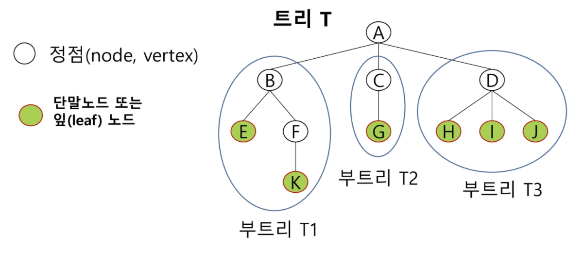

# Tree

## 트리

- 비선형 구조

- 상위 원소에서 하위 원소로 내려가면서 확장되는 트리(나무)모양의 계층형 자료구조

- 최상위 노드 - 루트(roow)

- 

  

## 이진트리

- 모든 노드들이 2개의 서브트리를 갖는 특별한 형태의 트리
- 각 노드가 자식 노드를 최대 2개까지만 가질 수 있음

### 포화이진트리(Full Binary Tree)

- 모든 레벨의 노드가 가득 차있는 트리
- 높이가 h일 때, 노드 갯수 = `2^(h+1) - 1`

### 완전이진트리(Complete Binary tree)

- 노드 1번부터 n번까지 빈 자리가 없는 이진 트리

### 이진트리 순회

- 순회란, 트리의 각 노드를 중복하지 않고 전부 방문하는 것

1. 전위 순회(Pre-order traversal)

   - 부모 노드, 왼쪽 자식 노드, 오른쪽 자식 노드 순으로 방문

   - ```python
     # 아래 이진트리 저장 기반,
     def pre_order(v):
         if v:
             print(v)
             pre_order(tree[v][0])
             pre_order(tree[v][1])
     ```

2. 중위 순회(In-order traversal)

   - 왼쪽 자식 노드, 부모 노드, 오른쪽 자식 노드 순으로 방문

   - ```python
     def in_order(v):
         if v:
             in_order(tree[v][0])
             print(v)
             in_order(tree[v][1])
     ```
   
3. 후위 순회(Post-order traversal)

   - 왼쪽 자식 노드, 오른쪽 자식 노드, 부모 노드 순으로 방문

   - ```python
     def post_order(v):
         if v:
             post_order(tree[v][0])
             post_order(tree[v][1])
             print(v)
     ```

### 이진트리 저장

```python
V = 13
edges = '1 2 1 3 2 4 3 5 3 6 4 7 5 8 5 9 6 10 6 11 7 12 11 13'
edge = list(map(int, edges.split()))
tree = [[0, 0, 0] for _ in range(V+1)]  # LeftChild RightChild Parent

# 트리 만들기
for i in range(len(edge)//2):
    p = edge[i*2]
    c = edge[i*2+1]
    if tree[p][0]:
        tree[p][1] = c
    else:
        tree[p][0] = c
    tree[c][2] = p
print(tree)

# 조상 찾기
c = 13  # tree안의 v
ans = []
while tree[c][2] != 0:
    ans.append(tree[c][2])
    c = tree[c][2]
print(ans)
```

## 이진탐색트리

- 탐색 작업을 효율적으로 하기 위한 자료구조
- 왼쪽 서브트리 값 < 루트 노드 값 < 오른쪽 서브트리 값
- 

### 힙(Heap)

- 최대 힙(Max Heap)

  - 키값이 가장 큰 노드를 찾기 위한 완전 이진 트리
  - 부모노드의 값 > 자식노드의 값

- 최소 힙(Min Heap)

  - 키값이 가장 작은 노드를 찾기 위한 완전 이진 트리
  - 부모노드의 값 < 자식노드의 값

- 삽입

  - ```python
    def enq(n):                             # 삽입
        global last
        last += 1
        tree[last] = n                      # 완전이진트리 유지
        c = last                            # 새로 추가된 정점을 자식으로
        p = c // 2                          # 완전이진트리에서의 부모 정점 번호
        while p > 0 and tree[p] < tree[c]:  # 부모가 있고, 자식의 키값이 더 크면 교환
            tree[p], tree[c] = tree[c], tree[p]
            c = p
            p = c // 2
            
    tree = [0] * 101                        # 포화이진트리의 정점번호
    last = 0                                # 마지막 정점 번호
    enq(3)
    enq(2)
    enq(4)
    enq(7)
    enq(5)
    enq(1)
    print(tree)
    ```

- 삭제

  - ```python
    def deq():                              # 삭제
        global last
        temp = tree[1]                      # 루트의 키값
        tree[1] = tree[last]                # 마지막 정점의 키값을 루트에 복사
        tree[last] = 0
        last -= 1                           # 마지막 정점 삭제
        p = 1
        c = p * 2                           # 왼족자식 노드 번호
        while c <= last:                    # 왼쪽자식이 있으면,
            if c+1 <= last and tree[c] < tree[c+1]:  # 오른쪽자식이 더 크면,
                c += 1                      # 오른쪽 자식 선택
            if tree[p] < tree[c]:           # 자식의 키값이 더 크면 교환
                tree[p], tree[c] = tree[c], tree[p]
                p = c
                c = p * 2
            else:
                break
    
        return temp
    
    tree = [0] * 101                        # 포화이진트리의 정점번호
    last = 0                                # 마지막 정점 번호
    while last > 0:
        print(deq(), tree[1])
    ```

