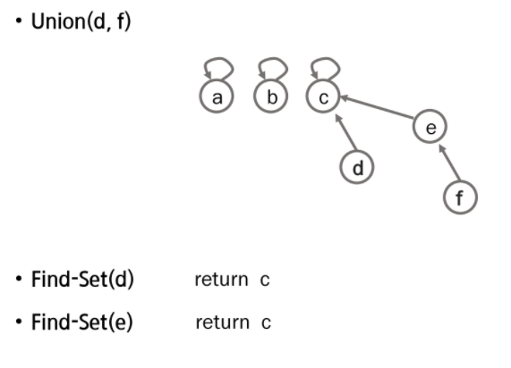
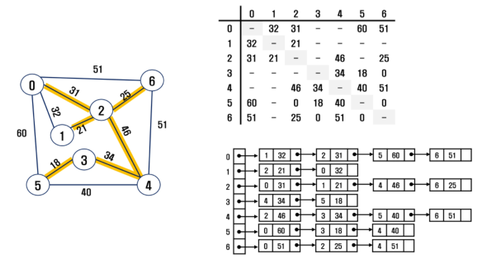
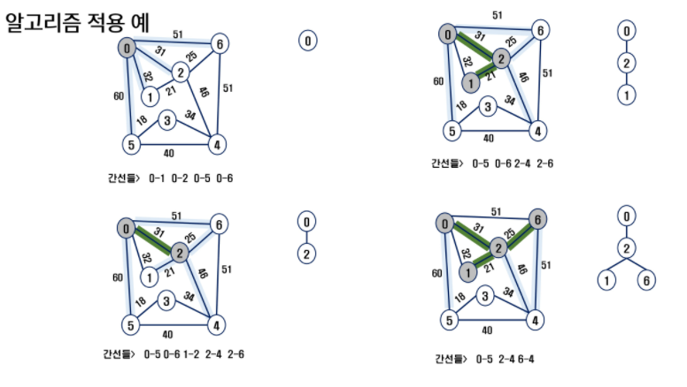
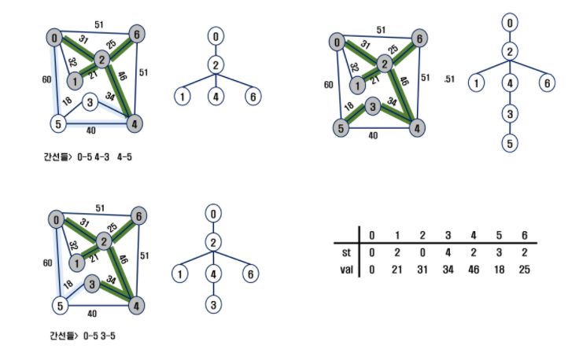
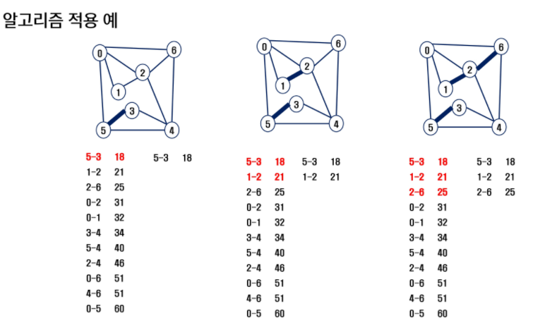

# 06-그래프(Graph)

## 그래프 기본

- 그래프는 아이템들과 이들 사이의 연결 관계를 표현
- 정점(Vertex)들의 집합과 이들을 연결하는 간선(Edge)들의 집합으로 구성된 자료 구조
- V개의 정점을 가지는 그래프는 최대 V*(V-1)/2 개의 간선을 가질 수 있음

## 그래프 탐색

- DFS: 스택 활용
- BFS: 큐 활용

## 서로소 집합들

- 서로소 또는 상호배타 집합들은 서로 중복 포함된 원소가 없는 집합들
- 교집합이 없음
- 집합에 속한 하나의 특정 멤버를 통해 각 집합들을 구분, 이를 대표자(representative)라 함
- 상호배타 집합 연산
  - `Make-Set(x)`
  - `Find-Set(x)`
  - `Union(x, y)`

### 상호배타 집합 표현 - 트리

- 하나의 집합을 하나의 트리로 표현

- 자식 노드가 부모 노드를 가리키며, 루트 노드가 대표자가 됨

- 자식 인덱스로 부모 번호를 저장

- 

  ```python
  # a~f => 1~6이라 하면, (1번 인덱스부터 시작)
  # Make-Set
  #   a  b  c  d  e  f
  [0, 1, 2, 3, 4, 5, 6]
  # Union(c, d), Union(e, f)
  #   a  b  c  d  e  f
  [0, 1, 2, 3, 3, 5, 5]
  ```

- 

  ```python
  # Make-Set
  #   a  b  c  d  e  f
  [0, 1, 2, 3, 4, 5, 5]
  # Union(c, d), Union(c, f)
  #   a  b  c  d  e  f
  [0, 1, 2, 3, 3, 3, 4]
  # Find
  Find-Set(d)  # c
  Find-Set(e)  # c
  ```
  
  - 랭크 내용은 p59 참고


## 최소 비용 신장 트리(MST)

- 그래프에서 최소 비용 문제
  1. 모든 정점을 연결하는 간선들의 가중치의 합이 최소가 되는 트리
  2. 두 정점 사이, 최소 비용 경로 찾기
- 신장 트리
  - n개의 정점으로 이루어진 무방향 그래프에서 n개의 정점과 n-1개의 간선으로 이루어진 트리
- 최소 신장 트리(Minimum Spanning Tree)
  - 무방향 가중치 그래프에서 신장 트리를 구성하는 간선들의 가중치의  합이 최소인 신장 트리

### MST 표현




### Prim 알고리즘

- 하나의 **정점**에서 연결된 간선들 중에 하나씩 선택하면서 MST를 만들어 가는 방식
  1. 임의 정점을 하나 선택
  2. 선택한 정점과 인접하는 정점들 중 최소 비용 간선으로 이어진 정점을 선택
  3. 모든 정점을 선택할 때까지 반복





```python
# 힙큐를 활용한 프림
def Prim():
    visited = [False] * (V+1)                       # 방문 체크 리스트
    key = [0] + [INF]*V                             # 각 노드에 도달하는 최소 가중치 값
    hq = [(0, 0)]                                   # 가중치 값, 시작 지점

    while False in visited:
        k, v = heapq.heappop(hq)
        visited[v] = True
        for v2, k2 in graph[v]:
            if not visited[v2] and k2 < key[v2]:     # 방문하지 않았고, 해당 지점의 값이 최소 가중치 값보다 작다면,
                key[v2] = k2                         # 갱신
                heapq.heappush(hq, (k2, v2))
    return sum(key)


T = int(input())
INF = float('inf')
for tc in range(1, T + 1):
    V, E = map(int, input().split())
    graph = [[] for _ in range(V + 1)]
    for _ in range(E):
        n1, n2, w = map(int, input().split())
        graph[n1].append((n2, w))
        graph[n2].append((n1, w))

    print(f'#{tc}', Prim())
```


```python
# 10000 => 최댓값
def prim1(s):
    key = [10000] * (V+1)
    key[s] = 0
    MST = [0] * (V+1)

    for _ in range(V):
        min_idx = -1
        min_V = 10000
        for i in range(V+1):
            if not MST[i] and key[i] < min_V:
                min_V = key[i]
                min_idx = i
        MST[min_idx] = 1
        for v in range(V+1):
            if not MST[v] and mat[min_idx][v] > 0:
                key[v] = min(key[v], mat[min_idx][v])

    return sum(key)


def prim2(s):
    MST = [0] * (V+1)                   # MST 포함 여부
    MST[s] = 1                          # 시작점 체크
    sum_w = 0                           # 가중치 합

    for _ in range(V):
        min_idx = 0                     # 최소 가중치 인덱스
        min_V = 10000                   # 최소 가중치
        for i in range(V+1):
            if MST[i] == 1:             # 지금까지 MST에 있고,
                for j in range(V+1):    # 값이 0과 min_v 사이이며, MST에 포함이 안되어 있다면,
                    if 0 < mat[i][j] < min_V and not MST[j]:
                        min_idx = j     # 갱신
                        min_V = mat[i][j]
        sum_w += min_V                  # 가중치 합 갱신
        MST[min_idx] = 1                # MST 갱신

    return sum_w


V, E = map(int, input().split())
mat = [[0]*(V+1) for _ in range(V+1)]
for _ in range(E):
    u, v, w = map(int, input().split())
    mat[u][v] = w
    mat[v][u] = w

# print(prim1(0))
print(prim2(0))
```

```python
"""
input
6 8
0 1 32
0 2 31
0 5 60
0 6 51
1 2 21
2 4 46
2 6 25
3 4 34
3 5 18
4 5 40
4 6 51
"""
```


### Kruskal 알고리즘(간선)

- **간선**을 하나씩 선택해서 MST를 찾는 알고리즘
  1. 모든 간선을 가중치에 따라 오름차순으로 정렬
  2. 가중치가 가장 낮은 간선부터 선택하면서 트리를 증가시킴
     - 이때, 사이클이 생기면, 다음으로 가중치가 낮은 간선 선택(서로소 집합 이용)
  3. n-1개의 간선을 선택할 때까지 반복




```python
def find_set(a):
    while a != rep[a]:
        a = rep[a]
    return a


def union(a, b):
    rep[find_set(b)] = find_set(a)


def Kruskal():
    N = V + 1                       # 정점 수
    cnt = 0                         # 선택한 edge 수
    sum_w = 0                       # 가중치 합
    for w, v, u in edge:
        if find_set(v) != find_set(u):
            cnt += 1
            union(u, v)
            sum_w += w
            if cnt == N - 1:        # 간선 수만큼 작업을 끝내면,
                break               # 끝!

    return sum_w


V, E = map(int, input().split())
edge = []
for _ in range(E):
    u, v, w = map(int, input().split())
    edge.append((w, v, u))
edge.sort()                         # 가중치(w)로 오름차순 정렬
rep = [i for i in range(V+1)]       # 대표원소 배열
print(Kruskal())
```

### 프림 vs 크루스칼

- E: 간선 수, V: 정점 수

- 크루스칼은 **간선이 적은 경우**에 유리하고, `O(ElogE)`

  프림은 **간선이 많은 경우**에 유리하다. `O(ElogV)`

- *ref)* https://ongveloper.tistory.com/376

## 최단 경로

- 간선의 가중치가 있는 그래프에서, 두 정점 사이 경로들 중, 간선 가중치 합이 최소인 경로
- 하나의 시작 정점에서 끝 정점까의 최단 경로
  - 다익스트라 알고리즘(Dijkstra)
    - 음의 가중치 허용x
  - 벨만-포드 알고리즘(Bellman-Ford)
    - 음의 가중치 허용o
- 모든 정점들에 대한 최단 경로
  - 플로이드-워샬 알고리즘(Floyd-Warshall)

### Dijkstra 알고리즘

- 시작 정점에서 거리가 최소인 정점을 선택해 나가면서 최단 경로를 구하는 방식


```python
import heapq


# 힙큐 활용 => 다음 노드 찾는 과정 최소화
def dijkstra(start):
    hq = []
    heapq.heappush(hq, (0, start))
    distances[start] = 0

    while hq:
        distance, current = heapq.heappop(hq)
        if distances[current] < distance:
            continue
        for new_node, weight in graph[current]:
            cost = distance + weight
            if cost < distances[new_node]:
                distances[new_node] = cost
                heapq.heappush(hq, (cost, new_node))
                

INF = float('INF')
V, E, end = map(int, input().split())
graph = [[] for _ in range(V+1)]
visited = [False for _ in range(V+1)]
distances = [INF for _ in range(V+1)]
for _ in range(E):
    s, e, w = map(int, input().split())
    graph[s].append((e, w))

dijkstra(0)
print(distances)
```


```python
def dijkstra(start, end):
    D = [0] * (V+1)             # 최단 경로
    U = [0] * (V+1)             # 비용이 결정된 지점(visited)
    U[start] = 1
    for i in range(V+1):
        D[i] = mat[start][i]

    for _ in range(V):          # 비용이 결정되지 않은 정점 중, D[min_idx]가 최소인 정점 결정
        min_V = 10000           # 최댓값으로 초기화
        min_idx = 0
        for i in range(V+1):
            if not U[i] and D[i] < min_V:
                min_V = D[i]
                min_idx = i
        U[min_idx] = 1
        for v in range(V+1):    # 0 < 이동할 수 있는 범위 < 10000
            if 0 < mat[min_idx][v] < 10000:
                D[v] = min(D[v], D[min_idx] + mat[min_idx][v])

    return D[end]


V, E = map(int, input().split())
mat = [[10000]*(V+1) for _ in range(V+1)]  # 10000 => 최댓값
for i in range(V+1):
    mat[i][i] = 0
for _ in range(E):
    u, v, w = map(int, input().split())
    mat[u][v] = w

ans = dijkstra(0, 3)
print(ans)
```

```python
"""
input
5 11
0 1 3
0 2 5
1 2 2
1 3 6
2 1 1
2 3 4
2 4 6
3 4 2
3 5 3
4 0 3
4 5 6
"""
```

