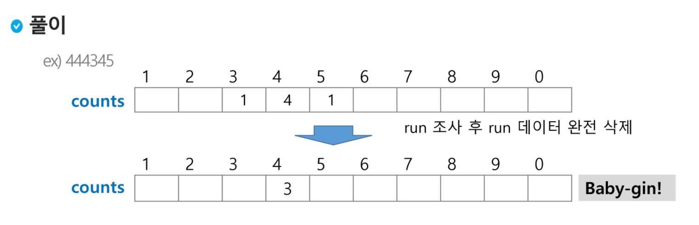

# 배열 1(Array 1)

## 알고리즘

- 유한한 단계를 통해 문제를 해결하는 절차나 방법

### 시간 복잡도

- 알고리즘의 작업량을 표현
- 빅-오 표기법(Big-O Notation)

## 배열

- 일정한 자료형의 변수들을 하나의 이름으로 열거해 사용하는 구조

### 1차원 배열

- `arr = list()	arr = [0] * 10	  arr = [1, 2, 3]`
- `arr[idx] = 20;` 배열 arr의 idx 원소에 20을 저장하라

## 정렬

- 특정 기준에 의해 오름차순, 혹은 내림차순으로 재배열하는 것
- 키: 자료를 정렬하는 기준 값

### 버블 정렬(Bubble sort)

- 인접한 두 개의 원소를 비교하며 자리를 계속 교환하는 방식
  - 첫 원소부터 인접한 원소끼리 계속 자리를 교환하면서 마지막 자리까지 이동
  - 한 단계가 끝나면 가장 큰 원소가 마지막 자리로 정렬
  - 교환하며 자리를 이동하는 모습이 물 위로 올라오는 거품같다...?
  
- O(n^2)

  ```python
  def BubbleSort(A, n):
      for i in range(n-1, 0, -1):
          for j in range(i):
              if A[j] > A[j+1]:
                  A[j], A[j+1] = A[j+1], A[j]
      return A
  ```

  

### 카운팅 정렬(Counting sort)

- 항목들의 순서를 결정하기 위해 집합에 각 항목이 몇 개씩 있는지 세는 작업을 하여, 선형 시간에 정렬하는 효율적인 알고리즘

- O(n+k): n은 리스트 길이, k는 정수의 최댓값

  ```python
  def CountingSort(A, B, k):
      C = [0] * (k+1)
      
      for i in range(len(A)):
          C[A[i]] += 1
          
      for i in range(1, len(C)):
          C[i] += C[i-1]
          
      for i in range(len(B)-1, -1, -1):
          C[A[i]] -= 1
          B[C[A[i]]] = A[i]
  ```

  

## Baby-gin game

```python
# 1, 2, 3 을 포함하는 모든 순열을 생성하는 함수
for i1 in range(1, 4):
    for i2 in range(1, 4):
        if i2 != i1:
            for i3 in range(1, 4):
                if i3 != i1 and i3 != i2:
                    print(i1, i2, i3)
```



```python
# num의 숫자별 카운트 리스트 만들기
num = 123789
c = [0] * 12  # run과 triplete을 같은 인덱스로 검사하기 위해 2칸을 더 늘림

while num > 0:
    c[num % 10] += 1
    num //= 10
    
# 풀이
i = 0
tri = 0
run = 0

while i < 10:
    if c[i] >= 3:  # tri 조사
        c[i] -= 3
        tri += 1
        continue
    if c[i] >=1 and c[i+1] >=1 and c[i+2] >=1:  # run 조사
        c[i] -= 1
        c[i+1] -= 1
        c[i+2] -= 1
        run += 1
        continue
    i += 1
    
if run + tri == 2: print('베이비진!')
else: print('ㄴㄴ!')
```

