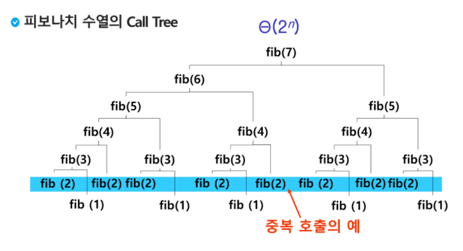

# 스택(Stack)

## 스택

- 물건을 쌓아 올리듯, 자료를 쌓아 올린 형태의 자료구조

- 후입선출(LIFO, Last-In-First-Out)

  ```python
  class Stack:
      def __init__(self, size):
          self.size = size
          self.items = [None] * self.size
          self.top = -1  # 없다
  
      def is_empty(self):
          return self.top == -1
  
      def is_full(self):
          return self.top == self.size - 1
  
      def push(self, item):
          if self.is_full():
              raise ValueError('Stack Overflow!')
          else:
              self.top += 1
              self.items[self.top] = item
  
      def pop(self):
          if self.is_empty():
              raise ValueError('Empty Stack. Nothing to pop.')
          else:
              item = self.items[self.top]
              self.items[self.top] = None
              self.top -= 1
              return item
  
      def peek(self):
          if self.is_empty():
              raise ValueError('Empty Stack. Nothing to peek.')
          else:
              return self.items[self.top]
  
      def __str__(self):  # print했을 때, 스택 시각화
          result = '\n-----'
          for item in self.items:
              if item is None:
                  result = f'\n|   |' + result
              else:
                  result = f'\n| {item} |' + result
          return result
  ```

  

## 재귀호출

### Memoization & DP

- 피보나치 수열의 Call Tree, 많은 중복 호출이 존재

- 

- Memoization을 적용한 피보나치 수열

  ```python
  def fibo(n):
      global memo
      if n >= 2 and len(memo) <= n:
          memo.append(fibo(n-1) + fibo(n-2))
      return memo[n]
  
  memo = [0, 1]
  ```

- DP(Dynamic Programming)를 적용한 피보나치 수열

  ```python
  def fibo(n):
      f = [0, 1]
      for i in range(2, n+1):
          f.append(f[i-1] + f[i-2])
      return f[n]
  ```

  

## DFS(Depth Firset Search)

- 깊이우선탐색
- 


