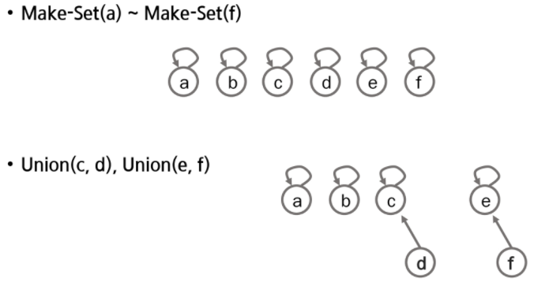
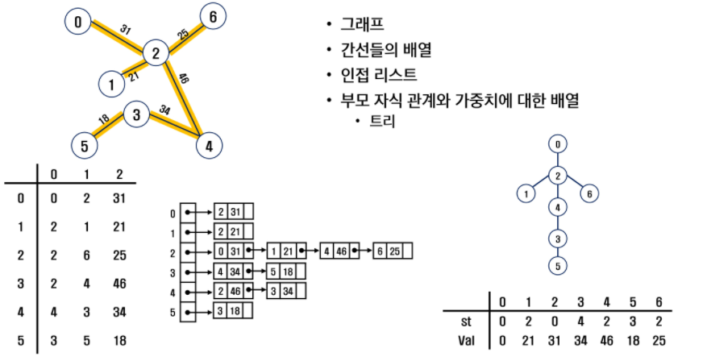
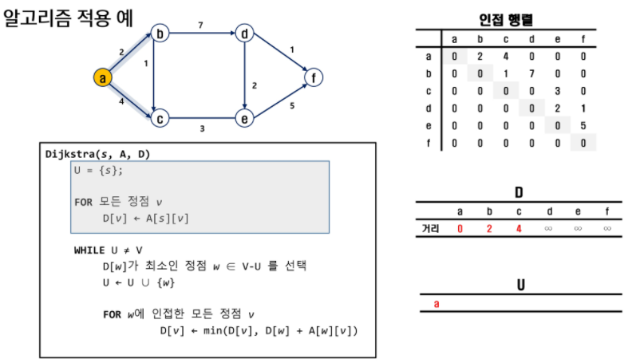
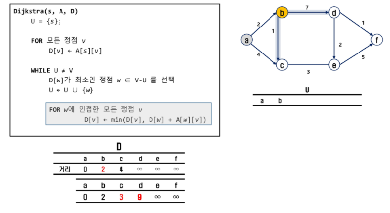
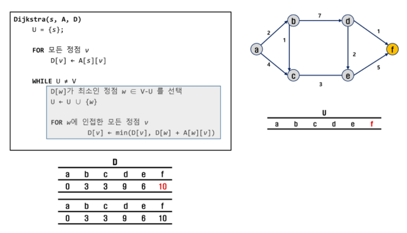

# 06-그래프(Graph)

## 그래프 기본

- 그래프는 아이템들과 이들 사이의 연결 관계를 표현
- 정점(Vertex)들의 집합과 이들을 연결하는 간선(Edge)들의 집합으로 구성된 자료 구조
- V개의 정점을 가지는 그래프는 최대 V*(V-1)/2 개의 간선을 가질 수 있음

## 그래프 탐색

- DFS: 스택 활용
- BFS: 큐 활용

## 서로소 집합들

- 서로소 또는 상호배타 집합들은 서로 중복 포함된 원소가 없는 집합들
- 교집합이 없음
- 집합에 속한 하나의 특정 멤버를 통해 각 집합들을 구분, 이를 대표자(representative)라 함
- 상호배타 집합 연산
  - Make-Set(x)
  - Find-Set(x)
  - Union(x, y)

### 상호배타 집합 표현 - 트리

- 하나의 집합을 하나의 트리로 표현

- 자식 노드가 부모 노드를 가리키며, 루트 노드가 대표자가 됨

- 자식 인덱스로 부모 번호를 저장

- 

  ```python
  # a~f => 1~6이라 하면, (1번 인덱스부터 시작)
  # Make-Set
  #   a  b  c  d  e  f
  [0, 1, 2, 3, 4, 5, 6]
  # Union(c, d), Union(e, f)
  #   a  b  c  d  e  f
  [0, 1, 2, 3, 3, 5, 5]
  ```

- 

  ```python
  # Make-Set
  #   a  b  c  d  e  f
  [0, 1, 2, 3, 4, 3, 6]
  # Union(c, d), Union(c, f)
  #   a  b  c  d  e  f
  [0, 1, 2, 3, 3, 3, 5]
  # Find
  Find-Set(d)  # c
  Find-Set(e)  # c
  ```
  
  - 랭크 내용은 p59 참고


## 최소 비용 신장 트리(MST)

- 그래프에서 최소 비용 문제
  1. 모든 정점을 연결하는 간선들의 가중치의 합이 최소가 되는 트리
  2. 두 정점 사이, 최소 비용 경로 찾기
- 신장 트리
  - n개의 정점으로 이루어진 무방향 그래프에서 n개의 정점과 n-1개의 간선으로 이루어진 트리
- 최소 신장 트리(Minimum Spanning Tree)
  - 무방향 가중치 그래프에서 신장 트리를 구성하는 간선들의 가중치의  합이 최소인 신장 트리

### MST 표현




### Prim 알고리즘

- 하나의 정점에서 연결된 간선들 중에 하나씩 선택하면서 MST를 만들어 가는 방식
  1. 임의 정점을 하나 선택
  2. 선택한 정점과 인접하는 정점들 중 최소 비용 간선으로 이어진 정점을 선택
  3. 모든 정점을 선택할 때까지 반복


```python
# 코드
```


### KRUSKAL 알고리즘

- 간선을 하나씩 선택해서 MST를 찾는 알고리즘
  1. 모든 간선을 가중치에 따라 오름차순으로 정렬
  2. 가중치가 가장 낮은 간선부터 선택하면서 트리를 증가시킴
     - 이때, 사이클이 생기면, 다음으로 가중치가 낮은 간선 선택(서로소 집합 이용)
  3. n-1개의 간선을 선택할 때까지 반복


```python
# 코드
```


## 최단 경로

- 간선의 가중치가 있는 그래프에서, 두 정점 사이 경로들 중, 간선 가중치 합이 최소인 경로
- 하나의 시작 정점에서 끝 정점까의 최단 경로
  - 다익스트라 알고리즘(Dijkstra)
  - 음의 가중치 허용x
  - 벨만-포드 알고리즘(Bellman-Ford)
    - 음의 가중치 허용o
- 모든 정점들에 대한 최단 경로
  - 플로이드-워샬 알고리즘(Floyd-Warshall)

### Dijkstra 알고리즘

- 시작 정점에서 거리가 최소인 정점을 선택해 나가면서 최단 경로를 구하는 방식







```python
# 코드
```

