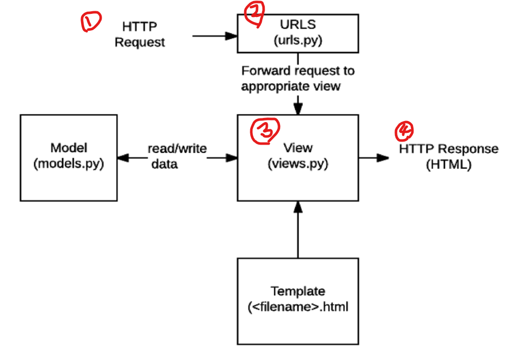

# Django

- 파이썬 웹 프레임워크

## Web Framework

- Static web page(정적 웹페이지)
  - 누가 요청을 해도 같은 응답을 보냄
  - 서버가 요청을 받을 때, 추가적인 처리 과정없이 클라이언트에게 응답을 보냄
- Dynamic web page(동적 웹페이지)
  - 조건에 따라 다른 응답을 보냄
  - 추가적인 처리과정 이후 클라이언트에게 응답을 보냄
  - 데이터베이스와의 상호작용
### Framework

  - 프로그래밍에서 특정 운영 체제를 위한 응용 프로그램 표준 구조를 구현하는 클래스와 라이브러리 모임
  - 재사용할 수 있는 많은 코드를 프레임워크를 통합함으로써, 다시 코드를 작성하지 않아도 같이 사용할 수 있도록 도움
  - Application Framework 라고도 함

=> 웹 프레임워크란, 웹 페이지를 개발하는 과정에서 겪는 어려움을 줄이는 것이 주 목적

#### Framework Architeture
  - MVC 디자인 패턴(model-view-controller)

  - Django는 MTV 패턴
    - Model
      - 응용프로그램의 데이터 구조 정의 및 데이터베이스 기록 관리
    - Template
      - 파일의 구조나 레이아웃 정의
      - 실제 내용을 보여주는데 사용
    - View
      - HTTP 요청 수신 및 반환
      - Model을 통해 요청을 충족시키는데 필요한 데이터에 접근
      - Template에 응답 서식 설정을 맡김
    
  - MTV 패턴

    

## Django Intro

### 순서

1. 가상환경 생성 및 활성화

   `$ python -m venv venv`

2. django 설치

3. 프로젝트 생성

   `$ django-admin startproject <name> .`

4. 서버켜서 로켓 확인

   `$ python manage.py runserver`

5. 앱 생성

   `$ python manage.py startapp <name>`

6. 앱 등록

## Template

- 데이터 표현을 제어하는 도구이자 표현에 관련된 로직

### Django Template Language(DTL)

- 조건, 반복, 변수 치환, 필터 등의 기능 제공
- `{{ }}`: 화면에 출력해야 하는 것
- ``: 그 외 전부

#### Variable

- `{{ variable }}`
- render()를 사용해 views.py에서 정의한 변수를 template 파일로 넘겨 사용

#### Filters

- `{{ variable|filter }}`
- 표시할 변수를 수정할 때 사용

#### Tags

- ``
- 출력 텍스트를 만들거나,반복 또는 논리를 수행하여 제어 흐름을 만드는 등 변수보다 복잡한 작업을 수행
- 일부 종료 태그가 필요
  - ` `


## 웹 페이지 흐름

MTV 패턴 그림 흐름과 동일한 흐름 - CRUD 학습 예시

*01-django_webex_practice 참고*

1. 가상 환경 만들기 `$ python -m venv venv`

2. 깃 이그노어 생성 `$ touch .gitignore`

3. pip 설치 `$ pip install -r <name>.txt`

4. 프로젝트 폴더 생성 `$ django-admin startproject <pjt-name> .`

5. 앱 생성 `$ python manage.py startapp <app-name>`

6. 앱 등록 `pjt-name/settings.py`에서 `INSTALLED_APPS`에 등록

   cf) `django-extensions`설치 시, `'django_extensions'`등록

7. base 템플릿 (root-folder에)생성 + 등록 `pjt-name/settings.py`에서 `TEMPLATES`의 `DIRS`에 등록 `BASE_DIR / 'templates'`

8. `admin`에 `DB`등록

   ```python
   # app-name/admin.py
   from django.contrib import admin
   from .models import Student, Article
   
   admin.site.register(Article)
   ```

9. `admin`계정 생성

   ```bash
   $ python manage.py makemigrations    # 이건 사실 필요한 지 정확히 모름
   $ python manage.py migrate			# 이거 안하면 admin계정 생성 불가
   $ python manage.py createsuperuser   # admin 계정 생성
   ```

8. `urls.py`

   ```python
   # pjt-name/urls.py
   from django.contrib import admin
   from django.urls import path, include
   
   urlpatterns = [
       path('admin/', admin.site.urls),
       path('articles/', include('articles.urls')),
   ]
   ```

   ```python
   # app-name/urls.py
   from django.urls import path
   from . import views
   
   app_name = 'articles'
   
   urlpatterns = [
       path('', views.article_read, name='read'),
       
       path('new/', views.article_new, name='new'),
       path('create/', views.article_create, name='create'),
   
       path('<int:pk>/', views.article_detail, name='detail'),
   
       path('<int:pk>/delete/', views.article_delete, name='delete'),
   
       path('<int:pk>/edit/', views.article_edit, name='edit'),
       path('<int:pk>/update/', views.article_update, name='update'),
   ]
   ```
   
11. `views.py`

    ```python
    from django.shortcuts import render, redirect
    from .models import Article
    
    # Create your views here.
    def article_read(request):
        # articles = Article.objects.all()  # 오름차순
        articles = Article.objects.all().order_by('-pk')  # 내림차순(pk값은 변경가능)
        context = {
          'articles': articles,
        }
        return render(request, 'articles/article_read.html', context)
    
    # 글 작성 버튼을 누르면 /articles/new/
    # form 제공
    # form 제출 시 /articles/create/
    def article_create(request):
        article = Article()
        article.title = request.POST['title']
        # article.title = request.POST.get(title)
        article.content = request.POST['content']
        article.save()
        return redirect('articles:detail', article.pk)
    
    
    def article_new(request):
        return render(request, 'articles/article_new.html')
    
    
    def article_detail(request, pk):
        article = Article.objects.get(pk=pk)
        context = {
          'article': article,
        }
        return render(request, 'articles/article_detail.html', context)
    
    
    def article_edit(request, pk):
        article = Article.objects.get(pk=pk)
        context = {
          'article': article,
        }
        return render(request, 'articles/article_edit.html', context)
    
    
    def article_update(request, pk):
        article = Article.objects.get(pk=pk)
        article.title = request.POST['title']
        article.content = request.POST['content']
        article.save()
        return redirect('articles:detail', article.pk)
    
    
    def article_delete(request, pk):
        article = Article.objects.get(pk=pk)
        if request.method == 'POST':
            article.delete()
            return redirect('articles:read')
        elif request.method == 'GET':
            return redirect('articles:detail', article.pk)
    ```

10. `models.py`

    ```python
    from django.db import models
    
    # Create your models here.
    class Article(models.Model):
        title = models.CharField(max_length=200)
        content = models.TextField()
        created_at = models.DateTimeField(auto_now_add=True)
        updated_at = models.DateTimeField(auto_now=True)
    
        def __str__(self):
            return f'{self.pk}) {self.title}'
    ```

11. `templates`

    ```django
     read(게시판) 
    
    
    
    <div>
      <h1>READ</h1>
    </div>
    <hr>
    <div>
      
      <div>
        {{ article.pk }})
        <a href="">{{ article.title }}</a>
        <hr>
      </div>
      
    </div>
    
    ```

    ```django
     new(새 글) 
    
    
    
    <h1>NEW ARTICLE</h1>
    <form action="" method='POST'>
      
      <div>
        <label for="title">제목: </label>
        <input type="text" id='title' name='title'>
      </div>
      <div>
        <label for="content">내용: </label>
        <textarea name="content" id="content" cols="30" rows="10"></textarea>
      </div>
      <div>
        <button>작성</button>
      </div>
    </form>
    <div>
      <a href="">BACK</a>
    </div>
    
    ```

    ```django
     detail(상세페이지) 
    
    
    
    <h1>{{ article.title }}</h1>
    <p>{{ article.content | linebreaksbr }}</p>
    <p>{{ article.created_at }} {{ article.updated_at }}</p>
    <div>
      <a href="">
        <button>수정</button>
      </a>
      <br> 
      <form action="" method='POST'>
        
        <button onclick="return confirm('진짜?')">삭제</button>
      </form>
    </div>
    
    
    ```

    ```django
     edit(수정) 
    
    
    
    <h1>EDIT ARTICLE</h1>
    <form action="" method='POST'>
      
      <div>
        <label for="title">제목: </label>
        <input type="text" id='title' name='title' value="{{ article.title }}">
      </div>
      <div>
        <label for="content">내용: </label>
        <textarea name="content" id="content" cols="30" rows="10">{{ article.content }}</textarea>
      </div>
      <div>
        <button>수정</button>
      </div>
    </form>
    <div>
      <a href="">BACK</a>
    </div>
    
    ```

    

