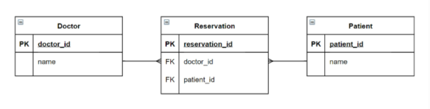

# 관계형 DB(1:N)

## Model Relationship 1

### Foreign Key

- 외래 키(외부 키)
- 관계형 DB에서 **한 테이블(참조되는)의 필드 중 다른 테이블(참조하는)의 행을 식별**할 수 있는 키
- 키를 사용하여 부모 테이블의 유일한 값(pk)을 참조(참조 무결성)

#### ForeignKey field

- 2개의 위치 인자가 필요
  1. 참조하는 model class
  2. on_delete 옵션
- migrate 작업 시, 필드 이름에 _id를 추가해 DB 열 이름을 만듬
- on_delete
  - 외래 키가 참조하는 객체가 사라졌을 때, 외래 키를 가진 객체를 어떻게 처리할 지 정의
  - CASCADE: 부모 객체가 삭제됐을 때, 이를 참조하는 객체도 삭제

```python
# articles/models.py
class Comment(models.Model):
    article = models.ForeignKey(Article, on_delete=models.CASCADE)
    content = models.CharField(max_length=200)
    created_at = models.DateTimeField(auto_now_add=True)
    updated_at = models.DateTimeField(auto_now=True)

    def __str__(self):
        return self.content
```

#### 1:N 관계 manager

- 역참조(`comment_set`)
  - Article(1) -> Comment(N)
  - article.comment 형태로 사용할 수 없고, article.comment_set 을 사용
  - 게시글에 몇 개의 댓글이 작성되었는지 장고가 보장할 수 없기 때문
  - 실제로 Article 에는 Comment와 어떠한 관계도 작성되어 있지 않음
- 참조(`article`)
  - Comment(N) -> Article(1)
  - comment.article 로 접근 가능


#### Comment CREATE

```python
# articles/urls.py
urlpatterns = [
    path('<int:pk>/comments/', views.comments_create, name='comments_create'),
]
```

```python
# articles/forms.py
class CommentForm(forms.ModelForm):

    class Meta:
        model = Comment
        fields = ('content',)
```

```python
# articles/views.py
@require_POST
def comment_create(request, pk):
    if request.user.is_authenticated:
        article = get_object_or_404(Article, pk=pk)
        comment_form = CommentForm(request.POST)
        if comment_form.is_valid():
            comment = comment_form.save(commit=False)
            comment.article = article
            comment.save()
        return redirect('articles:detail', article.pk)
    return redirect('accounts:login')
```


#### Comment READ

```python
# articles/views.py
@require_safe
def detail(request, pk):
    article = get_object_or_404(Article, pk=pk)
    comment_form = CommentForm()
    comments = article.comment_set.all()
    context = {
        'article': article,
        'comment_form': comment_form,
        'comments': comments,
    }
    return render(request, 'articles/detail.html', context)
```

```html
<h4>댓글 목록</h4>
<ul>
    
    <li>
        {{ comment.content }}
        <form action="" method="POST">
            
            <input type="submit" value="삭제">
        </form>
    </li>
    
</ul>
```


#### Comment DELETE

```python
# articles/views.py
@require_POST
def comment_delete(request, article_pk, comment_pk):
    if request.user.is_authenticated:
        comment = get_object_or_404(Comment, pk=comment_pk)
        comment.delete()
        return redirect('articles:detail', article_pk)
    return redirect('accounts:login')
```


### Customizing authentication in Django

- User 모델 대체하기
  - 일부 프로젝트에서 장고의 내정 User 모델이 제공하는 인증 요구사항이 적절하지 않을 수 있음
  - AUTH_USER_MODEL 값을 제공해, default user model을 재정의할 수 있도록 함
  - 장고는 새 프로젝트를 시작하는 경우, 커스텀 유저 모델을 설정하는 것을 강력 권장

```python
# settings.py
AUTH_USER_MODEL = 'accounts.User'
```

```python
# accounts/admin.py
from django.contrib import admin
from django.contrib.auth.admin import UserAdmin
from .models import User

admin.site.register(User, UserAdmin)
```

```python
# accounts/models.py
from django.db import models
from django.contrib.auth.models import AbstractUser

class User(AbstractUser):
    pass
```

- UserCreationForm, UserChangeForm이 기존 User모델을 사용하기 때문에 수정하기
  - get_user_model()
    - 현재 프로젝트에서 활성화된 사용자 모델(active user model)을 반환
    - 따라서, 장고는 User클래스를 직접 참조하는 대신, get_user_model()을 통해 참조해야 한다고 강조

```python
# accounts/forms.py
from django.contrib.auth import get_user_model

class CustomUserCreationForm(UserCreationForm):

    class Meta(UserCreationForm.Meta):
        model = get_user_model()
        fields = UserCreationForm.Meta.fields + ('email',)

    # class Meta:
    #     model = get_user_model()
    #     fields = '__all__'
```


#### AUTH_USER_MODEL 

- User를 나타내는데 사용하는 모델
- 기본값 = `'auth.User'`(auth 앱의 User 모델)
- 프로젝트 시작 시, 설정하는 것을 권장(중간에 변경하기가 아주 복잡함)
- (중간에 진행하는 경우)초기화하고 다시 makemigrations, migrate
  1. db.sqlite3 삭제
  2. migrations 파일 모두 삭제(파일명에 숫자가 붙은 파일들)

## Model Relationship 2

### User - Article (1:N)

#### settings.AUTH_USER_MODEL vs get_user_model()

- 전자 -> str
  - User모델에 대한 외래 키 또는 다대다 관계를 정의할 때 사용
  - **models.py에서 User모델을 참조할 때**
- 후자 -> object
  - 현재 활성화된 User모델을 반환
  - **models.py가 아닌 곳에서 User모델을 참조할 때**

#### *cf) 장고에서 app이 실행되는 순서*

1. 인스톨드앱에서 순차적으로 app import
2. 각 앱의 models를 import

```python
# articles/models.py
from django.db import models
from django.conf import settings

class Article(models.Model):
    ## 여기!!
    user = models.ForeignKey(settings.AUTH_USER_MODEL, on_delete=models.CASCADE)
    
    title = models.CharField(max_length=10)
    content = models.TextField()
    created_at = models.DateTimeField(auto_now_add=True)
    updated_at = models.DateTimeField(auto_now=True)

    def __str__(self):
        return self.title
    
class Comment(models.Model):
    ## 여기!!
    user = models.ForeignKey(settings.AUTH_USER_MODEL, on_delete=models.CASCADE)
    
    article = models.ForeignKey(Article, on_delete=models.CASCADE)
    content = models.CharField(max_length=200)
    created_at = models.DateTimeField(auto_now_add=True)
    updated_at = models.DateTimeField(auto_now=True)

    def __str__(self):
        return self.content
```

```python
# articles/views.py
@login_required
@require_http_methods(['GET', 'POST'])
def create(request):
    if request.method == 'POST':
        form = ArticleForm(request.POST)
        if form.is_valid():
            article = form.save(commit=False)
            article.user = request.user
            article.save()
            return redirect('articles:detail', article.pk)
    else:
        form = ArticleForm()
    context = {
        'form': form,
    }
    return render(request, 'articles/create.html', context)


@require_POST
def delete(request, pk):
    article = get_object_or_404(Article, pk=pk)
    if request.user.is_authenticated and request.user == article.user:
        article.delete()
    return redirect('articles:index')


@login_required
@require_http_methods(['GET', 'POST'])
def update(request, pk):
    article = get_object_or_404(Article, pk=pk)
    if request.user == article.user:
        if request.method == 'POST':
            form = ArticleForm(request.POST, instance=article)
            if form.is_valid():
                article = form.save()
                return redirect('articles:detail', article.pk)
        else:
            form = ArticleForm(instance=article)
    else:
        return redirect('articles:index')
    context = {
        'article': article,
        'form': form,
    }
    return render(request, 'articles/update.html', context)
```


### User - Comment (1:N)

```python
# articles/views.py
@require_POST
def comment_create(request, pk):
    if request.user.is_authenticated:
        article = get_object_or_404(Article, pk=pk)
        comment_form = CommentForm(request.POST)
        if comment_form.is_valid():
            comment = comment_form.save(commit=False)
            comment.article = article
            comment.user = request.user
            comment.save()
        return redirect('articles:detail', article.pk)
    return redirect('accounts:login')


@require_POST
def comment_delete(request, article_pk, comment_pk):
    comment = get_object_or_404(Comment, pk=comment_pk)
    if request.user.is_authenticated and request.user == comment.user:
        comment.delete()
        return redirect('articles:detail', article_pk)
    return redirect('accounts:login')
```

```html



  <h1>DETAIL</h1>
  <h3>{{ article.pk }}번째 글</h3>
  <hr>
  <p>제목 : {{ article.title }}</p>
  <p>내용 : {{ article.content }}</p>
  <p>작성 시각 : {{ article.created_at }}</p>
  <p>수정 시각 : {{ article.updated_at }}</p>
  <hr>
  
  <a href="">수정</a>
  <form action="" method="POST">
    
    <input type="submit" value="삭제">
  </form>
  
  <a href="">back</a>
  <hr>
  <h4>댓글 목록</h4>
  <ul>
    
      <li>
        {{ comment.user }}: {{ comment.content }}
        
        <form action="" method="POST">
          
          <input type="submit" value="삭제">
        </form>
        
      </li>
    
  </ul>
  
  <form action="" method="POST">
    
    {{ comment_form }}
    <input type="submit" value="작성">
  </form>
  
  <a href="">댓글을 쓰고 싶으면 로그인하세용~</a>
  

```


## Model Relationship 3

### M:N 관계

- 1:N의 한계

  - 새로운 예약을 생성하는 것이 불가능 -> 새로운 객체를 생성해야 함
  - 여러 의사에게 진료받은 기록을 환자 한 명에게 저장할 수 없음 -> 외래 키에 '1, 2'와 같은 형식의 데이터를 사용할 수 없음

  => 중계모델을 통한 M:N 관계

  

#### ManyToManyFIeld

- 다대다 관계 설정 시 사용하는 모델 필드
- 하나의 필수 위치인자(M:N 관계로 설정한 모델 클래스)가 필요

##### related_name

- 관계필드를 가지지 않은 모델이 가진 모델을 참조할 때 사용할 manager의 이름을 설정

##### through

- 중개 테이블을 직접 작성하는 경우, 이 옵션을 사용해 Django모델을 지정할 수 있음

##### symmetrical

- ManyToManyField가 동일한 모델(on self)을 가리키는 경우에 사용
- 예시) 팔로우 => 유저가 유저를 팔로우, 팔로잉함

##### Realted manager

- add()
  - 지정한 객체를 관련 객체 **집합**에 추가
  - 따라서 중복x
- remove()
  - 관련 객체 집합에서 지정한 모델 객체를 제거

#### 중개 테이블의 필드 생성 규칙

1. souce model 및 target model이 다른 경우
   - id / <containing_model>\_id / <other_model>\_id
2. ManyToManyField가 동일한 모델을 가리키는 경우
   - id / from\_\<model>\_id / to\_\<model>_id

### 예시) 좋아요!

```python
# articles/models.py
from django.db import models
from django.conf import settings

class Article(models.Model):
    user = models.ForeignKey(settings.AUTH_USER_MODEL, on_delete=models.CASCADE)
    like_users = models.ManyToManyField(settings.AUTH_USER_MODEL, related_name='like_articles')  # 이름지정안하면, .article_set 명령어가 겹침
    title = models.CharField(max_length=10)
    content = models.TextField()
    created_at = models.DateTimeField(auto_now_add=True)
    updated_at = models.DateTimeField(auto_now=True)

    def __str__(self):
        return self.title


class Comment(models.Model):
    article = models.ForeignKey(Article, on_delete=models.CASCADE)
    user = models.ForeignKey(settings.AUTH_USER_MODEL, on_delete=models.CASCADE)
    content = models.CharField(max_length=200)
    created_at = models.DateTimeField(auto_now_add=True)
    updated_at = models.DateTimeField(auto_now=True)

    def __str__(self):
        return self.content
```

- article.user: 게시글을 작성한 유저
- article.like_users: 게시글을 좋아요한 유저
- user.article_set: 유저가 작성한 게시글
- user.like_articles: 유저가 좋아요한 게시글

```python
# articles/views.py
@require_POST
def likes(request, article_pk):
    article = get_object_or_404(Article, pk=article_pk)
    # if request.user in article.like_users.all():
    if request.user.is_authenticated:
        if article.like_users.filter(pk=request.user.pk).exists():
            article.like_users.remove(request.user)
        else:
            article.like_users.add(request.user)
        return redirect('articles:index')
    return redirect('accounts:login')
```

- exists()
  - 쿼리셋에 결과가 포함되어 있다면 True, 그 외, False

```django
<!-- articles/index.html -->



  <h1>Articles</h1>
  
    <a href="">CREATE</a>
  
    <a href="">[새 글을 작성하려면 로그인 하세요]</a>
  
  <hr>
  
    <p>작성자: <a href="">{{ article.user }}</a></p>
    <p>글 번호: {{ article.pk }}</p>  
    <p>글 제목: {{ article.title }}</p>
    <p>글 내용: {{ article.content }}</p>
    <div>
      <form action="" method="post">
        
        
          <input type="submit" value="Like Cancel">
        
          <input type="submit" value="Like">
        
      </form>
    </div>
    <a href="">DETAIL</a>
    <hr>
  

```

### 예시) 프로필 + Followers/Followings

```python
# accounts/models.py
from django.db import models
from django.contrib.auth.models import AbstractUser

class User(AbstractUser):
    followings = models.ManyToManyField('self', symmetrical=False, related_name='followers')
```

```python
# accounts/views.py
def profile(request, username):
    person = get_object_or_404(get_user_model(), username=username)
    context = {
        'person': person,
    }
    return render(request, 'accounts/profile.html', context)
```

```django


<h1>{{ person.username }}님의 프로필</h1>


<div>팔로워: {{ followers|length }} / 팔로우: {{ followings|length }}</div>

<form action="" method="post">
  
  
    <input type="submit" value="Unfollow">
  
    <input type="submit" value="Follow">
  
</form>



<hr>
<h2>작성한 게시글</h2>

  <p>{{ article.title }}</p>

<h2>작성한 댓글</h2>

<p>{{ comment.content }}</p>

<h2>좋아요 누른 게시글</h2>

  <p>{{ article.title }}</p>  


```

