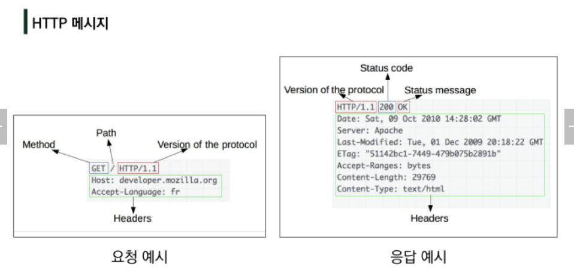

# REST API

## HTTP

- Hyper Text Transfer Protocol
- 웹 상에서 컨텐츠를 전송하기 위한 약속
- HTML 문서와 같은 리소스들을 가져올 수 있도록 하는 프로토콜(규칙, 약속)
- 요청(request), 응답(response)
- Stateless
- Connectionless
- 쿠키와 세션을 통해 서버 상태를 요청과 연결하도록 함



### HTTP request methods

- 자원(resource)에 대한 행위를 정의
- GET(조회), POST(작성), PUT(수정), DELETE(삭제) 등

### HTTP response status codes

1. 100~) informational response
2. 200~) Successful response
3. 300~) Redirection response
4. 400~) Client error response
5. 500~) Server error response

### URL, URN

- URL(Uniform Resource Locator)
  - 통합 자원 위치
  - 과거에는 실제 자원의 위치를 나타냈지만, 현재는 추상화된 의미론적인 구성
- URN(Uniform Resource Name)
  - 통합 자원 이름
  - URL과 달리 자원의 위치에 영향을 받지않는 유일한 이름 역할

### URI

- Uniform Resource Identifier
- 인터넷의 자원을 식별하는 유일한 주소
- URL, URN의 상위 개념(URN은 거의 사용을 안해서, URL과 같은 의미로 사용하기도 함)


## RESTful API

- REST원리를 따라 설계한 API
- 프로그래밍을 통해 클라이언트의 요청에 JSON을 응답하는 서버를 구성

### API

- Application Programming Interface
- 프로그래밍 언어가 제공하는 기능을 수행할 수 있게 만든 인터페이스
  - 앱과 프로그래밍으로 소통하는 방법
  - CLI는 명령줄, GUI는 그래픽(아이콘), API는 프로그래밍을 통해 특정 기능 수행
- Web API
  - 웹 앱 개발에서 다른 서비스에 요청을 보내고 응답을 받기 위해 정의된 명세
  - 현재는 직접 개발보다, Open API를 활용하는 추세
- 응답 데이터 파일
  - `HTML, XML, JSON` 등

### REST

- REpresentational State Transfer
- API Server를 개발하는 소프트웨어 설계 방법론
- 네트워크 구조 원리의 모음
  - 자원을 정의하고 자원에서 대한 주소를 지정하는 전반적인 방법
- 규칙
  - 정보는 URI로 표현
  - 행위는 HTTP Method로 표현
  - *지키지 않더라도 문제는 없음! 그래도 지키는 게 좋다고 함!*

#### REST의 자원과 주소 지정 방법

1. 자원
   - URI
2. 행위
   - HTTP Method
3. 표현
   - 자원과 행위를 통해 궁극적으로 표현되는 (추상화된)결과물
   - `JSON`으로 표현된 데이터를 제공

#### JSON

- JavaScript Object Notation
- 자바스크립트의 표기법을 따른 **단순 문자열**
- 사람이 읽고 쓰기 쉽고, 기계가 파싱(해석, 분석)하고 만들어내기 쉬움
- 파이썬의 `dictionary`, js의 `object`처럼 C 계열의 언어가 갖고 있는 자료구조로 쉽게 변화할 수 있는 `key-value` 형태의 구조를 갖고 있음


## Response

```bash
$ python pip install django-seed
$ python seed articles --number=20  # 더미데이터 20개 생성
```

```python
INSTALLED_APPS = [
    'django_seed',
]
```

### Content-type entity header

- 데이터의 media type(MIME type, content type)을 나타내기 위해 사용됨
- 응답 내에 있는 컨텐츠의 유형이 실제로 무엇인지 클라이언트에게 알려줌

### JsonResponse object

- JSON-encoded response를 만드는 HttpResponse의 서브 클래스

- `safe` parameter

  - `default = True`

  - `dict` 이외의 객체를 직렬화(Serialization)하려면 False로 설정해야함

  - ```python
    response = JsonResponse({'foo': 'bar'})
    response = JsonResponse([1, 2, 3], safe=False)
    ```

### Serialization

- 직렬화
- 데이터 구조나 객체 상태를 동일하거나 혹은 다른 컴퓨터 환경에 저장하고, 이후 재구성할 수 있는 포맷으로 변환하는 과정
- Serialization in Django
  - 쿼리셋 및 모델 인스턴스와 같은 복잡한 데이터를 `JSON`, `XML` 등의 유형으로 쉽게 변환할 수 있는 `Python` 데이터 타입으로 만들어줌

### Django REST framework(DRF)

```bash
$ pip install djangorestframework
```

```python
INSTALLED_APPS = [
    'rest_framework',
]
```

- DRF 라이브러리를 사용한 JSON 응답

```python
# articles/serializers.py
from rest_framework import serializers
from .models import Article

class ArticleSerializer(serializers.ModelSerializer):

    class Meta:
        model = Article
        fields = '__all__'
```

```python
from rest_framework.decorators import api_view
from rest_framework.response import Response
from .serializers import ArticleSerializer

@api_view()
def article_json_3(request):
    articles = Article.objects.all()
    serializer = ArticleSerializer(articles, many=True)
    return Response(serializer.data)
```

- Web API 구축을 위한 강력한 Toolkit을 제공하는 라이브러리

- ModelForm과 매우 유사하게 구성 및 작동

- Web API

  - 웹 애플리케이션 개발에서 다른 서비스에 요청을 보내고 응답을 받기 위해 정의된 명세

- |          |  Django   |    DRF     |
  | :------: | :-------: | :--------: |
  | Response |   HTML    |    JSON    |
  |  Model   | ModelForm | Serializer |

  

## Single Model

- 단일 모델의 data를 직렬화
- 단일 모델을 두고 CRUD 로직을 수행 가능하도록 설계
- API개발을 위한 핵심 기능을 제공하는 도구 활용
  - DRF built-in form
  - Postman
    - API를 구축하고 사용하기 위해 여러 도구를 제공하는 API 플랫폼
    - 설계, 테스트, 문서화 등 도구를 제공함으로써 API를 더 빠르게 개발 및 생성할 수 있도록 도와줌

### ModelSerializer

- 모델 필드에 해당하는 필드가 있는 `Serializer` 클래스를 자동으로 만들 수 있는 `shortcut`
- 모델 정보에 맞춰 자동으로 필드 생성
- 유효성 검사
- `.create()`, `.update()` 등 간단한 기본 구현이 포함

#### 'many' argument

- 단일 인스턴스 대신 쿼리셋 등을 직렬화하기 위해서는 `serializer`를 인스턴스화할 때 `many=True`를 키워드 인자로 전달해야 함

- ```python
  articles = ArticleSerializer(articles, many=True)
  ```

### GET - Article List, Article Detail

```python
# models.py
from django.db import models

class Article(models.Model):
    title = models.CharField(max_length=100)
    content = models.TextField()
    created_at = models.DateTimeField(auto_now_add=True)
    updated_at = models.DateTimeField(auto_now=True)
```

```python
# urls.py
urlpatterns = [
    path('articles/', views.article_list),
    path('articles/<int:article_pk>/', views.article_detail),
    path('articles/<int:article_pk>/comments/', views.comment_create),
]
```

```python
# serializers.py
from rest_framework import serializers
from .models import Article

class ArticleListSerializer(serializers.ModelSerializer):

    class Meta:
        model = Article
        fields = ('id', 'title',)

        
class ArticleSerializer(serializers.ModelSerializer):

    class Meta:
        model = Article
        fields = '__all__'

```

```python
# views.py
from django.shortcuts import get_list_or_404, get_object_or_404
from rest_framework.response import Response
from rest_framework.decorators import api_view
from rest_framework import status
from .models import Article
from .serializers import ArticleListSerializer, ArticleSerializer


@api_view(['GET'])
def article_list(request):
    if request.method == 'GET':
        articles = get_list_or_404(Article)
        serializer = ArticleListSerializer(articles, many=True)
        return Response(serializer.data)
    

@api_view(['GET'])
def article_detail(request, article_pk):
    article = get_object_or_404(Article, pk=article_pk)
    if request.method == 'GET':
        serializer = ArticleSerializer(article)
        return Response(serializer.data)
```

- api_view decorator
  - 기본적으로 `GET` 메서드만 허용, 그 외 405 에러
  - `view` 함수가 응답해야 하는 http메서드의 목록을 리스트 인자로 받음
  - **필수적으로 작성**해야 정상적으로 동작


### POST - Create Article

- Postman - HTTP body - form-data 에서 key와 value를 지정하여 입력할 수 있음

```python
@api_view(['POST'])
def article_list(request):
    if request.method == 'POST':
        serializer = ArticleSerializer(data=request.data)
        if serializer.is_valid(raise_exception=True):
            serializer.save()
            return Response(serializer.data, status=status.HTTP_201_CREATED)
```

- status module
  - 모듈 안에 HTTP status code 집합이 모두 포함되어 있음
  - `status=201` 처럼 사용할 수 있지만, 권장하지 않음
- raise_exception argument
  - `is_valid()` 에서 검사 오류가 있는 경우, 알아서 400페이지로 돌림


### DELETE - Delete Article

- data 내용 그대로 출력됨

```python
@api_view(['DELETE'])
def article_detail(request, article_pk):
    article = get_object_or_404(Article, pk=article_pk)
    if request.method == 'DELETE':
        article.delete()
        data = {
            'delete': f'{article_pk}번 게시글을 삭제했습니다.',
        }
        return Response(data, status=status.HTTP_204_NO_CONTENT)
```


### PUT - Update Article

```python
@api_view(['PUT'])
def article_detail(request, article_pk):
    article = get_object_or_404(Article, pk=article_pk)
    if request.method == 'PUT':
        serializer = ArticleSerializer(article, request.data)
        # serializer = ArticleSerializer(article, data=request.data)
        if serializer.is_valid(raise_exception=True):
            serializer.save()
            return Response(serializer.data)
```


## 1:N Realtion

```python
# models.py
from django.db import models

class Comment(models.Model):
    article = models.ForeignKey(Article, on_delete=models.CASCADE)
    content = models.TextField()
    created_at = models.DateTimeField(auto_now_add=True)
    updated_at = models.DateTimeField(auto_now=True)
```

```python
# serializers.py
from rest_framework import serializers
from .models import Article, Comment

class CommentSerializer(serializers.ModelSerializer):
    
    class Meta:
        model = Comment
        fields = '__all__'
        read_only_fields = ('article',)  # 읽기전용 필드, 유효성 검사는 안하되, 결과에는 포함됨


class ArticleSerializer(serializers.ModelSerializer):
    # Meta fields 안에 없는 값은 따로 읽기전용 설정이 필요 / 있는 값은 Meta에서 설정!

    # # 이름바꾸려면, 원래 모델에서 related_name 설정 후, 그 이름으로 설정하면 됨 => pk값만 출력
    # comment_set = serializers.PrimaryKeyRelatedField(many=True, read_only=True)  

    # 중첩된 관계 표현(1:N에서 사용) => 정보 전부 출력
    comment_set = CommentSerializer(many=True, read_only=True)

    # 조회한 게시글의 댓글 수 출력, article.comment_set.count()
    comment_count = serializers.IntegerField(source='comment_set.count', read_only=True)

    class Meta:
        model = Article
        fields = '__all__'

```

```python
# views.py
from django.shortcuts import get_list_or_404, get_object_or_404
from rest_framework.response import Response
from rest_framework.decorators import api_view
from rest_framework import status
from .models import Article, Comment
from .serializers import ArticleListSerializer, ArticleSerializer, CommentSerializer

@api_view(['GET'])
def comment_list(request):
    comments = get_list_or_404(Comment)
    serializer = CommentSerializer(comments, many=True)
    return Response(serializer.data)


@api_view(['GET', 'PUT', 'DELETE'])
def comment_detail(request, comment_pk):
    comment = get_object_or_404(Comment, pk=comment_pk)

    if request.method == 'GET':
        serializer = CommentSerializer(comment)
        return Response(serializer.data)

    elif request.method == 'DELETE':
        comment.delete()
        data = {
            'delete': f'{comment_pk}번 댓글을 삭제했습니다.',
        }
        return Response(data, status=status.HTTP_204_NO_CONTENT)

    elif request.method == 'PUT':
        serializer = CommentSerializer(comment, request.data)
        if serializer.is_valid(raise_exception=True):
            serializer.save()
            return Response(serializer.data)


@api_view(['POST'])
def comment_create(request, article_pk):
    article = get_object_or_404(Article, pk=article_pk)
    serializer = CommentSerializer(data=request.data)
    if serializer.is_valid(raise_exception=True):
        serializer.save(article=article)  # ForeignKey 지정
        return Response(serializer.data, status=status.HTTP_201_CREATED)
```

### `.save()` method

- Article 생성과 달리, Comment생성은 생성 시, 참조하는 모델의 객체 정보가 필요 => 외래 키
- `.save()` 메소드에서 인자로 받을 수 있음
  - `외래 키=객체`

### `read_only`

- 어떤 게시글에 작성하는 댓글인 지에 대한 정보(외래 키)를 `form-data`로 넘겨주지 않았기 때문에, 유효성 검사를 통과하지 못함

- 검증, 저장은 안할건데, JSON 생성은 하고싶다! 인 경우 사용

  - 검증, 저장은 하고, JSON 생성은 안하고싶다! 인 경우 => `write_only_fields`

- `save()` 메소드는 검사 이후

- 이때, 읽기전용 필드(`read_only_fields`)를 통해 직렬화하지 않고 반환 값에만 해당 필드가 포함되도록 할 수 있음

  - ```python
    class CommentSerializer(serializers.ModelSerializer):
        
        class Meta:
            model = Comment
            fields = '__all__'
            read_only_fields = ('article',)  # 읽기전용 필드, 유효성 검사는 안하되, 반환 값에는 포함됨
    ```

### 특정 게시글에서 댓글 정보 조회

#### 댓글 목록 출력

- PrimaryKeyRelatedField

  - `pk`를 사용해 관계된 대상을 나타낼 때 사용
  - 필드가 1에서 N을 가리키는 경우, `many=True` 필요
  - `comment_set`을 `form-data`로 받지 않으므로, `read_only=True` 필요
  - 이름바꾸려면, 원래 모델에서 `related_name` 설정 후, 그 이름으로 설정
- Nested relationships
  - 모델 관계 상으로 참조된 대상은 대상의 표현(응답)에 포함되거나 중첩(nested)될 수 있음
  - 참조하는 클래스를 위로 올리고 사용


### 댓글 갯수 출력

- 별도의 필드(`comment_count`)를 구성해 사용

#### `source` argument

- 필드를 채우는데 사용할 속성의 이름

#### 주의사항

- 특정 필드를 `override` 혹은 추가한 경우, `read_only_fields`에 추가할 수 없음!!!

```python
class ArticleSerializer(serializers.ModelSerializer):
    # Meta fields 안에 없는 값은 따로 읽기전용 설정이 필요 / 있는 값은 Meta에서 설정!

    # pk값만 출력
    comment_set = serializers.PrimaryKeyRelatedField(many=True, read_only=True)  

    # 정보 전부 출력
    comment_set = CommentSerializer(many=True, read_only=True)

    # 조회한 게시글의 댓글 수 출력, article.comment_set.count()
    comment_count = serializers.IntegerField(source='comment_set.count', read_only=True)

    class Meta:
        model = Article
        fields = '__all__'
```

​    

## cf

`request.date` => `form-data, query string` 등 다 받아옴

`request.POST` => `form-data + query string`

`request.GET` => `query string`만

`get_list_or_404` => 만약 게시글이 없으면, 에러페이지로 넘어감 => 내 생각에는 ux가 좋지 않아보임

​	해당 메소드에서 `return` => 밑에까지 안감
