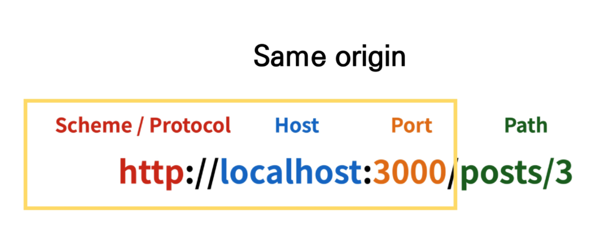
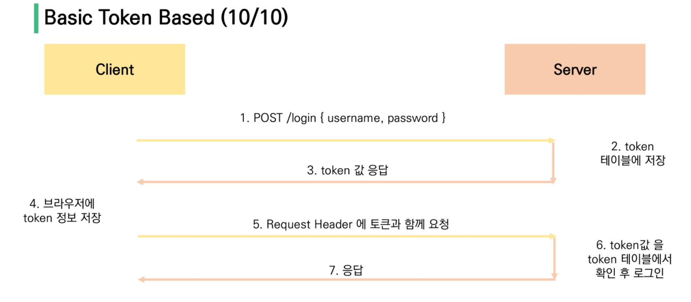

# 07

## Server & Client

### Server

- 클라이언트에게 정보 및 서비스를 제공하는 컴퓨터 시스템
- DB와 통신하며 데이터 CRUD
- 클라이언트 요청에 대한 응답

### Client

- 서버에 서비스를 요청하고, 필요한 인자를 서버에 제공하며, 서버의 응답을 사용자에게 적절한 방식으로 표현하는 기능을 가진 시스템
- 서버에 정보 요청


## CORS(Cross-Origin Resource Sharing)

### SOP(Same-Origin Policy)

- 동일 출처 정책

- 특정 출처(origin)에서 불러온 문서나 스크립트가 다른 출처에서 가져온 리소스와 상호작용하는 것을 제한하는 보안 방식

- Protocol, Host, Port 모두 같아야 같은 출처

  

### CORS

- 교차 출처 자원 공유
- 추가 HTTP header를 사용해, 다른 출처의 자원에 접근할 수 있는 권한을 부여하도록 브라우저에 알려주는 체제
- 다른 출처의 자원을 불러오려면, 해당 출처에서 올바른 CORS header를 포함한 응답을 반환해야 함

#### Why CORS?

- 브라우저 & 웹 어플리케이션 보호
  - 악의적인 사이트 데이터 사전 차단
  - 응답받는 자원에 대한 최소한의 검증
  - 서버는 응답하지만, 브라우저에서 차단
- 서버의 자원 관리
  - 해당 자원에 누가 접근할 수 있는지 관리 가능

#### How CORS?

- HTTP header를 사용

  - `Access-Control-Allow-Origin: *` 
  - 모든 도메인에서 접근할 수 있음을 의미
  - 특정 origin 명시 가능

- django-cors-headers 라이브러리

  - ```bash
    $ pip install django-cors-headers
    ```

  - ```python
    INSTALLED_APPS = [
        ...
        # CORS 세팅
        'corsheaders',
    	...
    ]
    
    MIDDLEWARE = [
        # CommonMiddleware보다 위에 위치
        'corsheaders.middleware.CorsMiddleware',
    	...
        'django.middleware.common.CommonMiddleware',
    	...
    ]
    
    CORS_ALLOW_ALL_ORIGINS = [
        # 허용할 도메인 입력
        'http://~~~',
    ]
    ```

    

## Authentication & Authorization

- Authentication - 인증
- Authorization - 권한 부여

### DRF Authentication

### Basic Token



### JWT(JSON Web Token)

- JSON 포맷을 활용해 요소 간 안전하게 정보를 교환하기 위한 표준 포맷
- JWT 자체가 필요한 정보를 주기 때문에, 검증을 위한 다른 수단이 필요없음(토큰 기반 인증방식과의 차이점)
- 토큰 탈취 시, 서버 측에서 토큰 무효화가 불가능하다는 단점이 있음


### `dj-rest-auth & django-allauth`

```bash
$ pip install django-allauth
$ pip install dj-rest-auth
```

```python
INSTALLED_APPS = [
	...  
    'rest_framework',
    'rest_framework.authtoken',  # token 기반 auth
    # DRF auth
    'dj_rest_auth',  # signup 제외 auth 관련 담당
    'dj_rest_auth.registration',  # signup 담당

    # signup 담당을 위해 필요 
    'allauth', 
    'allauth.account',
    'allauth.socialaccount',
	...
    'django.contrib.sites',  # dj-rest-auth signup 필요
]

# django.contrib.sites에서 등록 필요
SITE_ID = 1

# DRF 인증 관련 설정
REST_FRAMEWORK = {
    'DEFAULT_AUTHENTICATION_CLASSES': [
        'rest_framework.authentication.TokenAuthentication',
    ],
    'DEFAULT_PERMISSION_CLASSES': [
        # 모두에게 허용
        # 'rest_framework.permissions.AllowAny', 

        # 인증된 사용자만 모든일이 가능 / 비인증 사용자는 모두 401 Unauthorized
        'rest_framework.permissions.IsAuthenticated'
    ]
}

```

```python
urlpatterns = [
    path('admin/', admin.site.urls),
    ...
    # 패턴은 자유롭게 설정 가능, 포워딩만 dj_rest_auth로!
    path('api/v1/accounts/', include('dj_rest_auth.urls')),
    path('api/v1/accounts/signup/', include('dj_rest_auth.registration.urls')),
]
```

