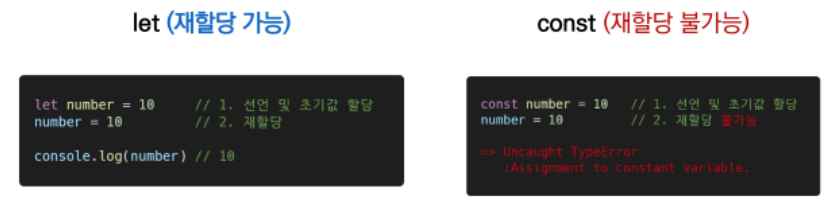
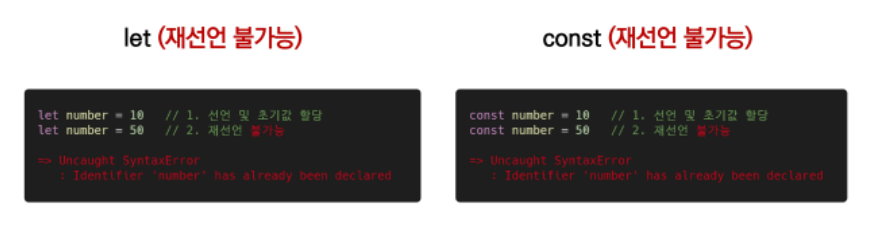
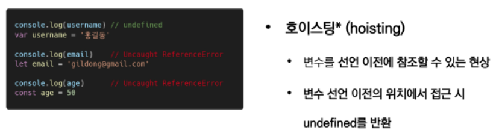
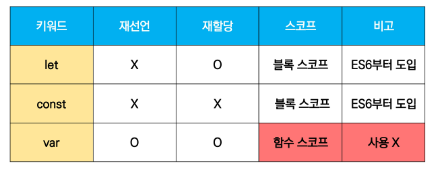
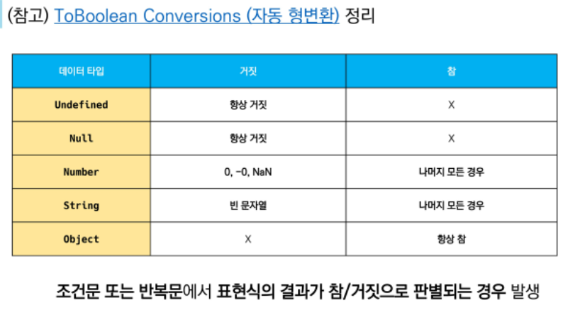
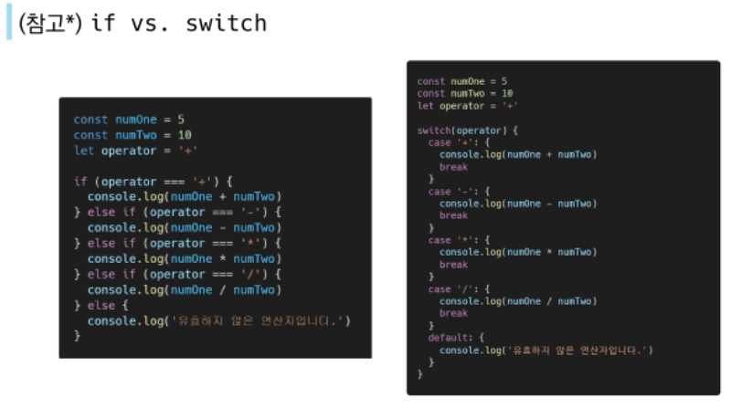
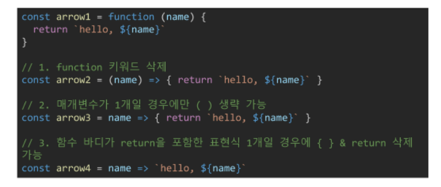
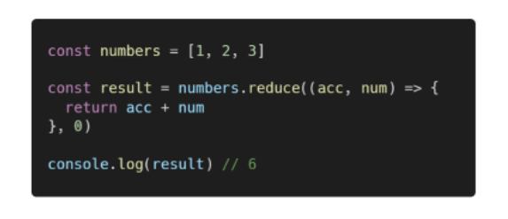
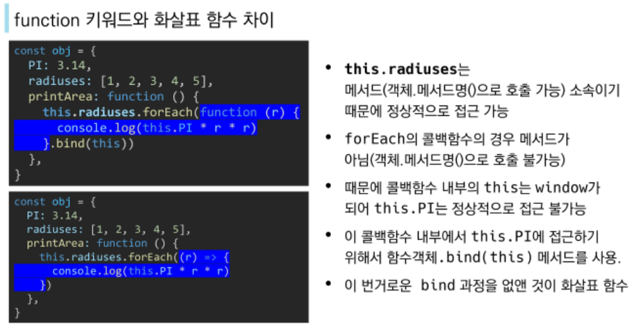
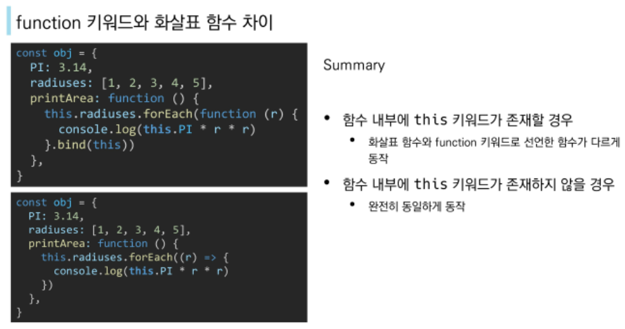

# 01

## Intro

### 브라우저(browser)

- `url`로 웹을 탐색하며 서버와 통신하고 html 문서나 파일을 출력하는 `GUI`기반의 소프트웨어

#### 브라우저에서 할 수 있는 일

- DOM(Document Object Model) 조작
  - html, xml과 같은 문서를 다루기 위한 프로그래밍 인터페이스
  - 문서가 객체로 구조화되어 있으며, `key`로 접근 가능
  - 파싱(parsing): 브라우저가 문자열을 해석해 DOM Tree로 만드는 과정
  - html 문서 조작
- BOM(Browser Object Model) 조작
  - 자바스크립트가 브라우저와 소통하기 위한 모델
  - `window` 객체는 모든 브라우저로부터 지원받으며 브라우저의 창(window)를 지칭
  - navigator, screen 등
- JavaSciprt Core (ECMAScipt)
  - 브라우저(DOM&BOM)을 조작하기 위한 명령어 약속(언어)
  - data structure 등

### JavaScript의 필요성

- 브라우저 화면을 '동적'으로 만들기 위함
- 브라우저를 조작할 수 있는 유일한 언어

### 세미콜론(semicolon)

- 쓰든 말든 상관없음
- 안써도 자동으로 ASI(자동 세미콜론 삽입 규칙)에 의해 세미콜론이 삽입됨


## 변수

- 식별자(identifier)는 변수를 구분할 수 있는 변수명을 말함
- 식별자는 반드시 문자, 달러(`$`), 혹은 밑줄(`_`)로 시작
- `for, if, function` 등 예약어 사용 불가능

### 식별자 작성 스타일

- 카멜 케이스(camelCase) - 변수, 객체, 함수
- 파스칼 케이스(PascalCase) - 클래스, 생성자
- 대문자 스네이크 케이스(SNAKE_CASE) - 상수에 사용

### 변수 선언 키워드

- `let`
  - 재할당 할 예정인 변수 선언 시 사용
  - 변수 재선언 불가능
  - 블록 스코프
  - 
  - 선언 - 변수를 생성하는 행위 혹은 시점
  - 할당 - 선언된 변수에 값을 저장하는 행위 혹은 시점
  - 초기화 - 선언된 변수에 처음으로 값을 저장하는 행위 혹은 시점
- `const`
  - 재할당 할 예정이 없는 변수 선언 시 사용
  - 변수 재선언 불가능
  - 블록 스코프

#### let vs const

- 일단 `const` 써~
- 생각보다 재할당하는 경우가 거~의 없다.










## 데이터 타입

### 원시 타입(Primitive type)

- 숫자(Number) 타입
  - 파이썬과 동일하나, 무한 값이 존재 => `1/0 = Infinity`
  - 계산 불가능한 경우, `NaN`반환
- 문자열(String)
  - 따옴표로 구분
  - 파이썬에서 `f'{firstname}'`
    - 자바스크립트에서는 백틱을 사용 => \`${firstname}`
- undefined
  - 변수의 값이 없음을 나타내는 타입
  - 변수 선언 이후 직접 값을 할당하지 않으면 자동으로 할당
- null
  - 변수의 값이 없음을 의도적으로 표현할 때 나타내는 타입
- Boolean
  - `true, false` (소문자)




### 참조 타입(Reference type)

- 함수
- 배열
- 객체


## 연산자

### 할당 연산자

- `+, -, *, /` 가능
- `+=` 이런것도 가능
- 그 외, `++` 1더하기, `--` 1빼기

### 비교 연산자

- 피연산자들을 비교하고 결과값을 `boolean`으로 반환하는 연산자
- 문자열도 가능
  - 유니코드 값을 사용 => 후순위, 소문자가 더 큼
- 동등 비교 연산자(`==`)
  - 안씀 (`1=='1' => true`나옴)
- 그래서 일치 비교 연산자(`===`) 씀
  - (`1==='1' => false`)
  - 배열을 비교하면, 객체의 주소값을 비교

### 논리 연산자

- and: `&&`
- or: `||`
- not: `!`

### 삼항 연산자

```javascript
let x = 2 < 1  // false
x ? 1 : 2  	   // 2
```


## 조건/반복

### 조건문

#### if

```javascript
if (condition) {
    // do something
} else if (condition) {
    // do something
} else {
    // do something
}
```


#### switch

- 표현식의 결과값을 이용한 조건문
- 표현식의 결과값과 case문의 오른쪽 값을 비교
- `break`가 없는 경우, `break`를 만나거나 혹은 `default`를 실행할 때까지 다음 조건문 실행

```javascript
switch (nation) {
    case 'Korea': {
        console.log('안녕')
        break
    }
    case 'France': {
        console.log('봉주루')
        break
    }
    default: {
        console.log('몰라')
    }
}
```



### 반복문

#### `while`

```javascript
let i = 0
while (i < 6) {
    console.log(i)
    i += 1 // i ++
}
// 0, 1, 2, 3, 4, 5
```


#### `for`

```javascript
for (initialization; condition; expression) {
    // do something
}
```

- 세미콜론(;)으로 구분되는 세 부분
- `initialization`
  - 최초 반복문 진입 시 1회만 실행되는 부분
- `condition`
  - 매 반복 시행 전 평가되는 부분
- `expression`
  - 매 반복 시행 이후 평가되는 부분

```javascript
for (let i=0; i<6; i++) {
    console.log(i)
}
```


#### `for ... in`

```javascript
for (variable in object) {
    // do something
}
```

- 객체(`object`)의 속성(`key`)들을 순회할 때 사용, `for ... in`에서 객체는 `딕셔너리`
- 따라서, 배열에서 사용하지 않음


#### `for ... of`

```javascript
for (variable of iterables) {
    // do something
}
```

- 반복 가능한(iterable) 객체를 순회하며 값을 꺼낼 때 사용

```javascript
const fruits = ['딸기', '바나나', '메롱']
for (let fruit of fruits) {
    fruit = fruit + '!'
    console.log(fruit)
}
```

- 이때 `in`을 쓰면, 인덱스가 출력됨


## 함수

- 매개변수와 인자의 개수 불일치 허용

### 일급 객체(First-class citizen, object)

- 변수에 할당 가능
- 함수의 매개변수(인자)로 전달 가능
- 함수의 반환 값으로 사용 가능


### 함수 선언식(f declaration)

- 함수의 이름과 함께 정의하는 방식

- 이름, 매개변수(인자), 몸통(body)

- 호이스팅o

- ```javascript
  function name(args) {
      // do something
  }
  ```

  

### 함수 표현식(f expression)

- 함수를 표현식 내에서 정의하는 방식

- 익명 함수로 정의 가능

- 호이스팅x

- ```javascript
  const name = function (args) {
      // do something
  }
  ```


### Rest/Spread Operator(`...`)

- `...`을 사용해 팩/언팩이 가능(인자가 없다면, 빈 배열)


### Arrow Function

- 함수를 간결하게 정의할 수 있는 문법
- `function` 키워드 생략 가능
- 함수의 매개변수가 하나라면, `()` 생략 가능
- 함수 몸통이 표현식 하나라면, `{}`와 `return` 생략 가능
- 


## 문자열, 배열, 객체

### 문자열

- `includes` - 특정 문자열의 존재여부를 참/거짓으로 반환
- `split` - 문자열을 토큰 기준으로 나눈 배열 반환
- `replace` - 해당 문자열을 대상 문자열로 교체해 반환
- `trim` - 문자열의 좌우 공백 제거해 반환(`trimStart, trimEnd`)

### 배열

- 키와 속성들을 담고 있는 참조 타입의 객체

- 순서를 보장

- 배열의 길이는, `arr.length`로 접근 가능, 마지막 원소는 `arr[arr.length-1]`

- 매소드

  - `reverse` - 원본 배열의 요소 순서를 반대로 정렬
  - `push, pop` - 배열의 가장 뒤 요소를 추가/제거
  - `unshift, shift` - 배열의 가장 앞 요소를 추가/제거
  - `includes` - 배열에 특정 값이 존재하는지, 참/거짓 반환
  - `indexOf` - 요소가 존재하면 인덱스 반환, 없으면 -1
  - `join` - 배열의 모든 요소를 구분자를 이용해 연결

- 매소드 심화

  - `forEach` - 배열의 각 요소에 대해 콜백 함수를 한 번씩 실행
  - `map` - 배열의 각 요소에 대해 콜백 함수를 한 번씩 실행하고, 함수의 반환 값을 요소로 하는 새로운 배열을 반환
  - `filter` - 배열의 각 요소에 대해 콜백 함수를 한 번씩 실행하고, 함수의 반환 값이 참인 요소를 모아 새로운 배열을 반환
  - `find` - 배열의 각 요소에 대해 콜백 함수를 한 번씩 실행하고, 함수의 반환 값이 참이라면, 그 요소를 반환하고 실행을 중단
  - `every` - 배열의 모든 요소가 판별 함수를 통과해야 참을 반환, 그 외 거짓
  - `some` - 배열의 요소 중 하나라도 판별 함수를 통과하면 참을 반환, 그 외 거짓
  - `reduce` - 배열의 각 요소에 대해 콜백 함수를 한 번씩 실행하고, 콜백 함수의 반환 값들을 하나의 값(`acc`)에 누적 후 반환, 인자로 `acc`와 `초기값`을 필요로 함
    - 

  

### 객체

- 객체는 속성의 집합이며, 중괄호 내부에 `key`와 `value`의 쌍으로 표현
- `key`는 문자열만 가능
- `value`는 모든 타입 가능(함수도 포함)
- 요소 접근은 점 또는 대괄호로 가능 => `obj.name or obj['name']`
- 메소드 접근은 점으로 가능 => `ojb.method()`

#### ES6 추가 문법

- 객체를 정의할 때,` key`와 `value`명이 **같다**면 축약 가능

  - ```js
    // books: books => books
    const me = {
        name,
        books,
        age
    }
    ```

    메소드 선언 시 `function` 키워드 생략 가능

  - ```javascript
    // 객체 내부
    greeting: function () { console.log('hi') } 
    // => 
    greeting() { console.log('hi') }
    ```

- 객체를 정의할 때 `key`의 이름을 표현식을 이용해 동적으로 생성 가능

  - ```javascript
    const key = 'regions'
    const values = ['서울', '경기']
    const ssafy = {
        [key]: values,
    }
    console.log(ssafy.regions)  // ['서울', '경기']
    ```

- 배열 혹은 객체를 분해하여 속성을 변수에 쉽게 할당하는 방법

  - ```javascript
    const savedFile = {
          name: 'profile',
          extension: 'jpg',
          size: 29930
    }
    
    // 변수 할당에서도 가능
    const name = savedFile.name
    const { name } = savedFile
    const { name, extension, size } = savedFile
    
    
    // 함수에서도 가능
    function fileSummary({ name, extension, size }) {
          console.log(`The file ${name}.${extension} is size of ${size} bytes.`)
    }
    
    fileSummary(savedFile)
    ```

#### JSON

- `key-value` 쌍의 형태로 데이터를 표기하는 언어 독립적 표준 포맷
- JS의 객체와 유사하나, 실제로는 문자열 타입
- `JSON.parse()`: JSON => JS객체
- `JSON.stringify()`: JS객체 => JSON

## `this`

- JS의 this는 실행 문맥에 따라 다른 대상을 가리킴

  - class 내부의 생성자(constructor) 함수
    - 생성되는 객체를 가리킴(`python`의 `self`와 유사)
  - 메서드
    - 해당 메서드가 소속된 객체를 가리킴
  - 위 두가지 경우를 제외하면, 모두 최상위 객체(`window`)를 가리킴
  - `화살표 함수`를 쓰면, `bind(this)` 포함이라 생각해도 됨, 함수 내부에 `this` 키워드가 있다면 일반 `function`과 `화살표 함수`의 차이가 나타남





## `lodash`

- 모듈성, 성능 및 추가 기능을 제공하는 JS 유틸리티 라이브러리

```javascript
<script src="https://cdn.jsdelivr.net/npm/lodash@4.17.21/lodash.min.js"></script>
```

