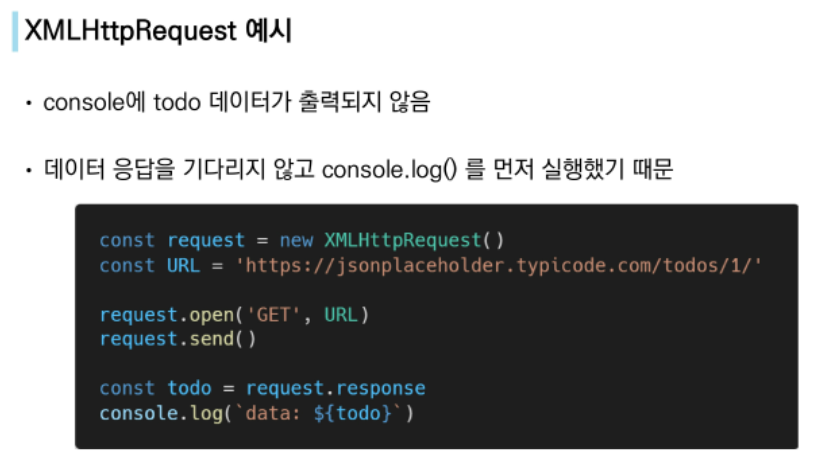
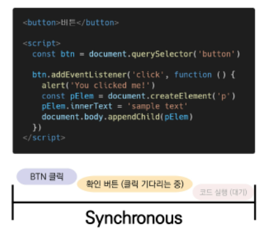
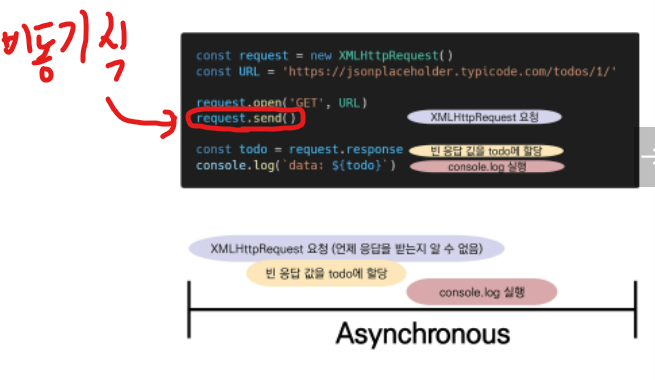
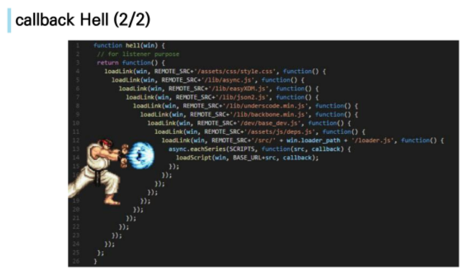
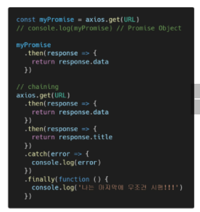
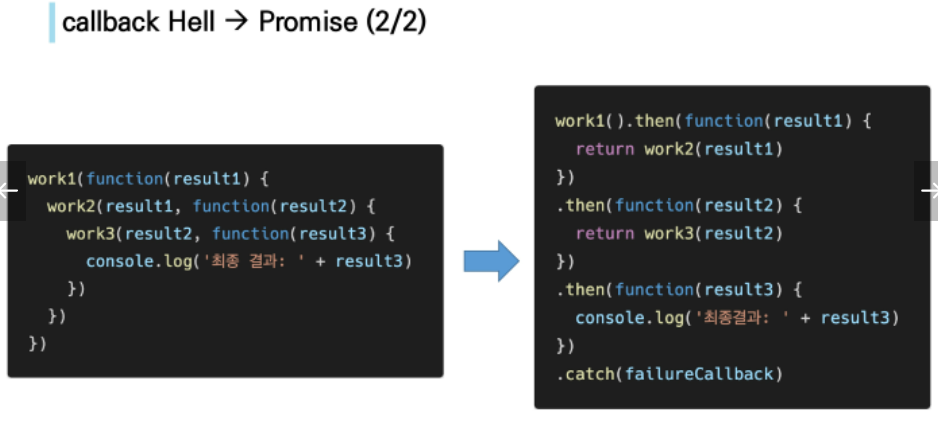

# 03

## AJAX

- AJAX란?
  - Asynchronous JS and XML (비동기식 JS와 XML)
  - 서버와 통신하기 위해 XMLHttpRequest 객체 활용
  - JSON, XML, HTML 그리고 일반 텍스트 형식 등을 포함한 다양한 포맷을 주고받음
- 특징
  - 페이지 전체를 reload(새로고침)하지 않아도 되는 **비동기성**
  - 새로고침없이 서버에 요청
  - 서버로부터 데이터를 받고 작업 수행

### XMLHttpRequest 객체

- 서버와 상호작용하기 위해 사용되며 전체 페이지의 새로고침없이 데이터를 받아올 수 있음
- 이름과 달리 XML 뿐만 아니라 모든 종류의 데이터를 받아올 수 있음
- 


## Asynchronous JS

- 동기식
  - 순차적, 직렬적 Task 수행
  - 요청을 보낸 후 응답을 받아야만 다음 동작이 이루어짐(blocking)
  - 버튼 클릭 후 alert 메시지의 확인 버튼을 누를 때까지 문장이 만들어지지 않음
  - 
- 비동기식
  - 병렬적 Task 수행
  - 요청을 보낸 후 응답을 기다리지 않고 다음 동작이 이루어짐
  - 
  - JS는 single thread


- 왜 비동기식을 사용하는가?
  - 사용자 경험
    - 동기식 코드라면 데이터를 모두 불러온 뒤 앱이 실행 => 데이터를 모두 불러올 때까지 앱이 멈춘 것처럼 보임
    - 비동기식 코드라면 데이터를 요청하고 응답받는 동안 앱 실행을 같이 진행 => 데이터를 불러오는 동안 지속적으로 응답하는 화면을 보여줌
- Threads
  - 프로그램이 작업을 완료하기 위해 사용할 수 있는 단일 프로세스
  - 각 스레드는 한 번에 하나의 작업만 수행할 수 있음
- JS는 single threaded
  - 컴퓨터가 여러 cpu를 갖고 있어도 main thread라 불리는 단일 스레드에서만 작업 수행
  - 이벤트를 처리하는 call stack이 하나인 언어라는 의미
  - 이를 해결하기 위해 JS는, p.27
    1. 즉시 처리하지 못하는 이벤트들을 Web API로 보내서 처리
    2. 처리된 이벤트들은 Task queue에 줄 세움
    3. call stack이 비면 Event Loop이 Task queue에서 가장 앞의 이벤트를 call stack으로 보냄
       - Call Stack
         - 요청이 들어올 때마다 해당 요청을 순차적으로 처리하는 stack
       - Web API
         - JS엔진이 아닌 브라우저 영역에서 제공하는 API
         - ajax, 시간 관련 => 언제 끝날지 모르는 애들을 관리
       - Task Queue
         - 비동기 처리된 callback함수가 대기하는 queue
         - main thread가 끝난 후 실행되어 후속 JS코드가 차단되는 것을 방지
       - Evnet Loop
         - Call Stack이 비었는지 확인
         - 비었으면 Task queue에서 대기중인 callback 함수 확인하고 있으면 가장 앞의 함수를 Call stack으로 push
         - 시간 중요x, Call stack이 비어야만 push 진행

- 순차적인 비동기 처리하기
  - Web API로 들어오는 순서는 중요치 않고, 어떤 이벤트가 먼저 처리되냐가 중요
  - 이를 해결하기 위해 순차적인 비동기 처리를 위한 2가지 작성 방식
    1. Async callbacks
       - 백그라운드에서 실행을 시작할 함수를 호출할 때 인자로 지정된 함수
       - 예시) 이벤트리스너의 두번째 인자
    2. promise-style
       - Modern Web APls에서의 새로운 코드 스타일
       - XMLHttpRequest 객체를 사용하는 구조보다 조금 더 현대적인 버전


### Callback Function

- 다른 함수에 인자로 전달된 함수

#### Async callbacks

- 백그라운드에서 코드 실행을 시작할 함수를 호출할 때 인자로 지정된 함수
- 백그라운드 코드 실행이 끝나면 callback 함수를 호출해 작업 완료를 알리거나, 다음 작업을 실행하게 할 수 있음
- callback 함수를 다른 함수의 인수로 전달할 때, 함수의 참조를 인수로 전달할 뿐이지, 즉시 실행되지 않고 함수의 body에서 "called back" 됨

#### callback Hell(or pyramid of doom)

- 여러 개의 연쇄 비동기 작업을 할 때 마주하는 상황
- 디버깅, 코드 가독성 통제가 매우 힘듬
- 
- 해결 방법 - Promise callbacks(Promise 콜백 방식 사용)


### Promise

- 비동기 작업의 최종 완료 또는 실패를 나타내는 객체
  - 미래의 완료 또는 실패와 그 결과 값을 나타냄
  - 미래의 어떤 상황에 대한 약속
- 성공에 대한 약속 - `.then()`
- 실패에 대한 약속 - `.catch()`
- 

#### Promise methods

- `.then(callback)`
  - 이전 작업(promise)이 성공했을 때 수행할 작업을 나타내는 callback 함수
  - 각 callback 함수는 이전 작업의 성공 결과를 인자로 전달받음
  - 따라서 성공했을 때의 코드를 callback 함수 안에 작성
- `.catch(callback)`
  - `.then`이 하나라도 실패하면 동작
  - 이전 작업의 실패로 인해 생성된 **error 객체**는 catch 블록 안에서 사용할 수 있음
- 각각의 `.then()`블록은 서로 다른 promise를 반환
  - 여러 비동기 작업을 차례대로 수행할 수 있다는 뜻
  - 반환 값이 반드시 있어야 함 => 메소드로 이어져 있기 때문
- `.finally(callback)`
  - promise 객체를 반환
  - 결과와 상관없이 무조건 지정된 callback 함수가 실행
  - 어떠한 인자도 전달받지 않음
- 

#### Promise가 보장하는 것

1. callback 함수는 JS의 Event loop가 현재 실행 중인 Call Stack을 완료하기 이전에는 절대 호출되지 않음
2. 비동기 작업이 성공하거나 실패한 뒤에 `.then()` 메소드를 이용해 추가한 경우에도 1번과 같이 동작
3. `.then()`을 여러번 사용해 여러개의 callback 함수를 추가할 수 있음(Chaining)
   - 각각의 callback은 주어진 순서대로 하나하나 실행하게 됨


### Axios

- 브라우저를 위한 Promise 기반의 클라이언트

- 편리한 AJAX 요청이 가능하도록 도와줌

- ```js
  <script src="https://cdn.jsdelivr.net/npm/axios/dist/axios.min.js"></script>
  ```

- 

- `.catch()` 에서 `console.log()` 대신 `console.error()`을 쓰기도 함 (에러같이 출력해줌)


### *cf) async & await*

- 비동기 코드를 작성하는 새로운 방법

  - ECMAScipt 2017(ES8)에서 등장

- **기존 Promise 시스템** 위에 구축된 syntactic sugar

  - Promise 구조의 then chaining을 제거
  - 본직적으로 문법적 기능은 then chaining과 동일하되, 사용자가 직관적으로 코드를 읽을 수 있도록 만듬

- 사용법

  1. async-await를 사용하려면, 함수로 묶어야 한다.
  2. 해당 함수 맨 앞에 async 라는 키워드로 표시를 남긴다.
  3. 함수 블록 내부에, 비동기로 동작하는 함수들을 찾아서 앞에 await를 남긴다.

  ```js
  const URL = 'https://dog.ceo/api'
  
  // then chaining
  function fetchDogImages() {
      axios.get(URL + '/breeds/list/all')
          .then(res => {
          const breedObj= res.data.message
          const breedArray = Object.keys(breedObj)
          const breed = breedArray[0]  // 아펜핀셔
          return axios.get(URL + `/breed/${breed}/images`)
      })
          .then(res => console.log(res.data))
          .catch(err => console.error(err))
  }
  
  fetchDogImages()
  
  // async & await
  async function fetchDogImages() {
      const res = await axios.get(URL + '/breeds/list/all')
      const breedObj= res.data.message
      const breedArray = Object.keys(breedObj)
      const breed = breedArray[0]  // 아펜핀셔
      const images = await axios.get(URL + `/breed/${breed}/images`)
      console.log(images)
  }
  
  fetchDogImages()
      .catch(err => console.error(err))
  ```

  

