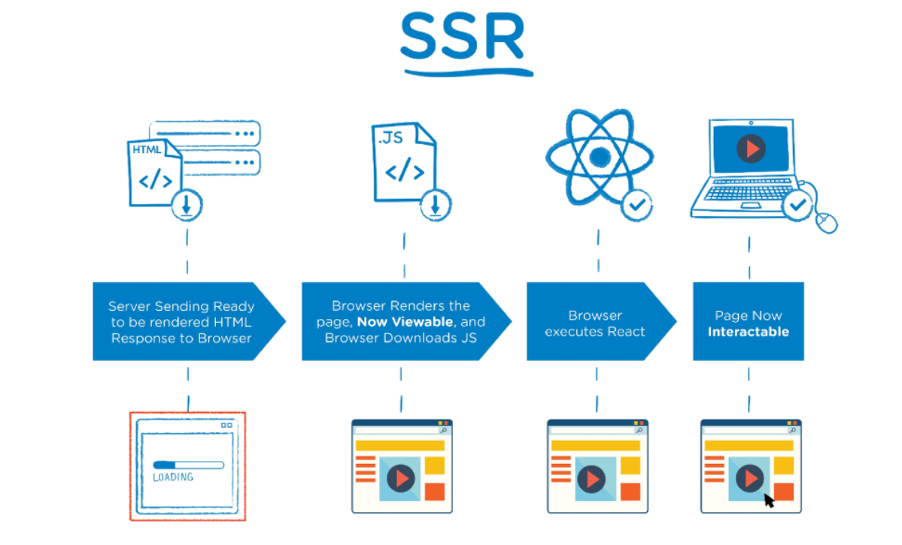
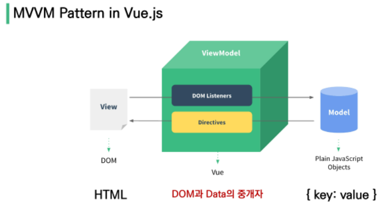

# 01

## Intro

- Front-End 개발
  - HTML, CSS 그리고 JS를 활용해 데이터를 볼 수 있도록 해줌
  - 사용자와 데이터의 상호작용(Interaction)
- Vue.js, React, Angular 등, 대표적인 FE 프레임워크

### Vue.js

- 사용자 인터페이스를 만들기 위한 진보적인 JS 프레임워크
- 현대적인 tool과 다양한 라이브러리를 통해 SPA(SIngle Page Application)를 완벽히 지원

### SPA(Single Page Application)

- 단일 페이지로 구성되며 서버로부터 최초에만 페이지를 다운로드하고 이후에는 동적으로 DOM을 구성
- 처음 페이지를 받은 이후부터는 서버로부터 새로운 전체 페이지를 다시 불러오는 것이 아니라, 현재 페이지 중 필요한 부분만 동적으로 다시 작성

#### SPA 등장 배경

- 과거 웹 사이트들은 요청에 따라 매번 새로운 페이지를 응답하는 방식이었음 => M(Multi)PA
- 이를 해결하기 위해 Vue.js와 같은 FE 프레임워크가 등장 => CSR(Client Side Rendering), SPA의 등장

### CSR(Client Side Rendering)

- 서버에서 화면을 구성하는 S(Server)SR방식과 달리 클라이언트에서 화면을 구성
- 최초 요청 시 HTML, CSS, JS 등 데이터를 제외한 각종 리소스를 응답받고 이후 클라이언트에서 필요한 데이터만 요청해 JS로 DOM을 렌더링하는 방식
- 즉, 처음에 뼈대만 받고, 브라우저에서 동적으로 DOM을 그림 => SPA가 사용하는 렌더링 방식
- 
- 장점:
  1. 서버와 클라이언트 간 트래픽 감소
     - 웹 앱에 필요한 모든 정적 리소스를 최초 한 번만 다운로드하고 필요한 데이터만 갱신
  2. 사용자 경험(UX) 향상
     - 전체 페이지를 다시 렌더링하지 않고, 변경되는 부분만을 갱신하기 때문
- 단점:
  1. SSR에 비해 전체 페이지 최종 렌더링 시점이 느림
  2. SEO(검색 엔진 최적화)에 어려움이 있음 => 최초 문서에 데이터 마크업이 없기 때문

### SSR(Server Side Rendering)

- 서버에서 클라이언트에게 보여줄 페이지를 모두 구성해 전달하는 방식
- JS 웹 프레임워크 이전에 사용되던 전통적인 렌더링 방식
- 
- 장점:
  1. 초기 구동 속도가 빠름
  2. SEO(검색 엔진 최적화)에 적합
- 단점:
  1. 모든 요청마다 새로운 페이지를 구성해 전달 => UX 떨어짐, 트래픽 상승

### SSR vs CSR

- 렌더링을 누가 하냐의 차이 => 서버가 만드냐(SSR) vs 클라이언트가 만드냐(CSR)
- 뭐가 좋다가 아니라, 적절히 선택하는 것이 중요


## Why Vue.js?

- 현대 웹 페이지는 페이지 규모가 계속 커지고 있으며, 그만큼 사용하는 데이터도 늘어나고 사용자와의 상호작용도 많이 이루어짐 => Vanila JS만으로 커버가 힘듬
- DOM과 Data가 연결되어 있고, Data를 변경하면 이에 연결된 DOM은 알아서 변경
- 즉, 신경쓸 것은 오직 Data에 대환 관리(Developer Exp, DX 향상)


## Concepts of Vue.js

### MVVM Pattern

- 앱 로직은 UI로부터 분리하기 위해 설계된 디자인 패턴

  1. Model
  2. View
  3. View Model

  

#### Model, View

- Model
  - Vue에서 Model은 JS 객체이다.
- View
  - Vue에서 View는 HTML이다.

#### ViewModel

- Vue에서 ViewModel은 모든 Vue Instance이다.
- ViewModel을 활용해 Data를 얼마만큼 잘 처리해서 보여줄 것인지(DOM)를 고민하는 것


## Quick Start

- Django
  - url => views => template
- Vue.js
  - Data가 변화하면 DOM이 변경
    1. Data로직 작성
    2. DOM 작성

```js
<script src="https://cdn.jsdelivr.net/npm/vue/dist/vue.js"></script>
```

### 0504 실습 폴더 참고!!

## Basic Syntax

### 0504 실습 폴더 참고!!

### Vue instance

- 모든 Vue앱은 Vue함수로 새 인스턴스를 만드는 것부터 시작
- Vue instance === Vue component

#### el

- Vue 인스턴스에 연결할 기존 DOM요소가 필요
- new를 이용한 인스턴스 생성 시에 사용

#### data

- Vue 인스턴스의 데이터 객체
- 상태 데이터를 정의하는 곳

#### methods

- Vue 인스턴스에 추가할 메소드
- 화살표 함수를 메소드를 정의하는데 사용하면 안됨
  - 화살표 함수가 부모 컨텍스트를 바인딩하기 때문, this는 Vue 인스턴스가 아님

### Template Syntax

#### Interpolation(보간법)

- Text

  ```html
  <span>메시지: {{ msg }}</span>
  ```

- Raw HTML

  ```html
  <span v-html="rawHtml"></span>
  ```

- Attributes

  ```html
  <div v-bind:id="dynamicId"></div>
  ```

- JS 표현식

  ```html
  {{number + 1}}
  {{ message.split('').reverse().join('') }}
  ```


#### Directive

- v- 접두사가 있는 특수 속성

- 속성 값은 단일 JS 표현식이 됨(v-for는 예외)

- 전달인자

  - ":" 을 통해 전달인자를 받을 수 있음

    ```html
    <a v-bind:href="url">...</a>
    <a v-on:click="doSomething">...</a>
    ```

- 수석어

  - "." 으로 표시되는 특수 접미사

  - directive를 특별한 방법으로 바인딩해야 함을 나타냄

    ```html
    <form v-on:submit.prevent="onSubmit">...</form>
    ```

- v-text

  - 엘리먼트의 textContent를 업데이트

  - 내부적으로 interpolation 문법이 v-text로 컴파일됨

  - ```html
    <body>
      <div id="app">
        <p>{{ message }}</p>
        <p v-text="message"></p>
      </div>
      
      <script src="https://cdn.jsdelivr.net/npm/vue/dist/vue.js"></script>
      <script>
        const app = new Vue({
          el: '#app',
          data: {
            message: 'hello'
          }
        })
      </script>
    ```

    

- v-html

  - innerHTML을 업데이트 => 쓰지마셈 (XSS 공격에 취약)

- v-show

  - 조건부 렌더링

  - 요소는 항상 렌더링되고 DOM에 남아있음

  - 단순히 display CSS 속성을 토글하는 것(display: none 등

  - ```html
    <body>
      <div id="app">
        <p v-show="isTrue">True</p>
        <p v-show="isFalse">False</p>
      </div>
      
      <script src="https://cdn.jsdelivr.net/npm/vue/dist/vue.js"></script>
      <script>
        const app = new Vue({
          el: '#app',
          data: {
            isTrue: true,
            isFalse: false,
          }
        })
      </script>
    ```

    

- v-if, v-else-if, v-else

  - 조건부 렌더링

  - 조건에 따라 요소를 렌더링

  - directive의 표현식이 true일 때만 렌더링

  - 엘리먼트 및 포함된 directive는 토글하는 동안 삭제되고 다시 작성됨

  - ```html
    <body>
      <div id="app">
        <p v-if="seen">seen is true</p>
        <p v-if="myType === 'A'">A</p>
        <p v-else-if="myType === 'B'">B</p>
        <p v-else-if="myType === 'C'">C</p>
        <p v-else>there is no ABC</p>
      </div>
    
      <script src="https://cdn.jsdelivr.net/npm/vue/dist/vue.js"></script>
      <script>
        const app = new Vue({
          el: '#app',
          data: {
            seen: false,
            myType: 'A',
          }
        })
      </script>
    ```

    

- v-show vs v-if

  - 자주 변경되는 요소의 경우 v-show가 적절
  - 아니라면, v-if가 적절

- v-for

  - 원본 데이터를 기반으로 엘리먼트 또는 템플릿 블록을 여러번 렌더링

  - item in items 구문 사용

  - (item, idx) in items 도 가능 (idx 순서 주의)

  - v-if와 함께 사용 시, v-for가 우선순위가 높음 => 동시에 쓰지마셈 왠만하면

  - ```html
    <body>
      <div id="app">
        <h2>String</h2>
        <h2>Array</h2> 
        <h2>Object</h2>
      </div>
    
      <script src="https://cdn.jsdelivr.net/npm/vue/dist/vue.js"></script>
      <script>
        const app = new Vue({
          el: '#app',
          fruits: ['apple', 'banana', 'coconut'],
        })
      </script>
    </body>
    ```

    

- v-on(@)

  - 엘리먼트에 이벤트 리스너 연결

  - 이벤트 유형은 전달인자로 표시

  - 특정 이벤트가 발생했을 때, 주어진 코드 실행

  - ```html
    <body>
      <div id="app">
        <!-- 메서드 핸들러 -->
        <button @click="alertHello">Button</button>
        <!-- 기본 동작 방지 -->
        <form action="" @submit.prevent="alertHello"> <!-- @submit.prevent만 쓰면 그냥 이벤트만 막음! -->
          <button>gogo</button>
        </form>
        <!-- 키 별칭을 이용한 키 입력 수식어 -->
        <input type="text" @keyup.enter="log"> <!-- 엔터 쳤을때만 log 실행, space 등등 가능 -->
        <input type="text" @keyup.enter="log('a')">
    
        <p>{{ message }}</p>
        <button @click="changeMessage">change</button>
      </div>
      
      <script src="https://cdn.jsdelivr.net/npm/vue/dist/vue.js"></script>
      <script>
        const app = new Vue({
          el: '#app',
          data: {
            message: 'Hello VUEEEEE',
          },
          methods: {
            alertHello() {
              alert('HELLOOO')
            },
            log(event) {
              console.log(event)
            },
            changeMessage() {
              this.message = 'Magic!'
            }
          }
        })
      </script>
    ```

    

- v-bind(:)

  - HTML 요소 속성에 Vue의 상태 데이터를 값으로 할당

  - 객체 형태로 사용하면 value가 true인 key가 class 바인딩 값으로 할당

  - ```html
    <body>
      <div id="app">
        <!-- 속성 바인딩 -->
        
        
        <hr>
    
        <!-- 클래스 바인딩 -->
        <div :class="{ active: isRed }">클래스 바인딩</div>
        <hr>
        <h3 :class="[activeRed, myBackground]">hello vue</h3>
        <!-- 스타일 바인딩 -->
        <p :style="{ fontSize: fontSize + 'px' }">this is parag</p>
      </div>
      
      <script src="https://cdn.jsdelivr.net/npm/vue/dist/vue.js"></script>
      <script>
        const app = new Vue({
          el: '#app',
          data: {
            fontSize: 16,
            imageSrc: '123456',
            isRed: true,
            activeRed: 'active',
            myBackground: 'my-background-color'
          }
        })
      </script>
    ```

    

- v-model

  - HTML form 요소의 값과 data를 양방향 바인딩

  - 수식어

    - .lazy

      input 대신 change 이벤트 이후 동기화

    - .number

      문자열을 숫자로 변경

    - .trim

      입력에 대한 trim을 진행

  - ```html
    <body>
      <div id="app">
        <h2>Input -> Data</h2>
        <p>{{ msg1 }}</p>
        <input id="box" @input="onInputChange" type="text">
        <hr>
    
        <h2>Input <-> Data</h2>
        <p>{{ msg2 }}</p>
        <input v-model="msg2" type="text">
        <hr>
        <input v-model="checked" type="checkbox">
        <label for="box">{{ checked }}</label>
      </div>
    
      <script src="https://cdn.jsdelivr.net/npm/vue/dist/vue.js"></script>
      <script>
        const app = new Vue({
          el: '#app',
          data: {
            msg1: '111',
            msg2: '222',
            checked: true,
          },
          methods: {
            onInputChange(event) {
              this.msg1 = event.target.value
            }
          }
        })
      </script>
    ```

    


#### computed

- 데이터를 기반으로 계산된 속성

- 함수의 형태로 정의하지만, 함수가 아닌 반환 값이 바인딩됨

- 종속된 데이터가 변경될 때만 함수를 실행

- 반드시 반환 값이 필요

- ```html
  <body>
    <div id="app">
      <p>Original: {{ message }}</p>
      <p>Reverse By Method: <strong>{{ reverseMessage() }}</strong></p>
      <p>Reverse By Computed: <strong>{{ reversedMessage }}</strong></p>
    </div>
    
    <script src="https://cdn.jsdelivr.net/npm/vue/dist/vue.js"></script>
    <script>
      const app = new Vue({
        el: '#app',
        data: {
          message: 'Original',
        },
        methods: {
          reverseMessage() {
            return this.message.split('').reverse().join('')
          }
        },
        computed: {
          reversedMessage() {
            return this.message.split('').reverse().join('')
          }
        }
      })
    </script>
  ```

  

##### computed vs methods

- computed는 종속된 대상이 변경되지 않는 한, 여러 번 호출되어도 다시 계산하지 않고 이미 계산된 값을 반환
- methods는 호출할 때마다 실행

#### watch

- computed의 명령형이라 생각하면 됨
- 안씀!! => 90% 이상 computed로 바꿔쓸 수 있음!!

#### filter

- 텍스트 형식화를 적용할 수 있는 필터

- JS 표현식 마지막에 "|" (파이프)와 함께 추가해야함 => chaining 가능 

- ```html
  <body>
    <div id="app">
      {{ numbers | getOddNumbers | getUnderTen }}
      {{ getOddAndUnderTen }}
    </div>
  
    <script src="https://cdn.jsdelivr.net/npm/vue/dist/vue.js"></script>
    <script>
      const app = new Vue({
        el: '#app',
        data: {
          numbers: [1, 2, 3, 4, 5, 6, 7, 8, 9, 10, 11, 12, 13, 14, 15],
        },
        filters: {
          getOddNumbers(array) {
            const oddNumbers = array.filter(num => num % 2)
            return oddNumbers
          },
          getUnderTen(array) {
            return array.filter(num => num < 10)
          }
        },
        computed: {
          getOddAndUnderTen() {
            return this.numbers.filter(num => num%2 && num < 10)
          }
        }
      })
    </script>
  ```

  

## Lifecycle Hooks

- 각 Vue 인스턴스는 생성될 때 일련의 초기화 단계를 거침

- 그 과정에서 사용자 정의 로직을 실행할 수 있는 Lifecycle Hooks도 호출됨

- 

- ```html
  <body>
    <div id="app">
      
      <button @click="getImg">GetDog</button>
    </div>
    
    <script src="https://cdn.jsdelivr.net/npm/axios/dist/axios.min.js"></script>
    <script src="https://cdn.jsdelivr.net/npm/vue/dist/vue.js"></script>
    <script>
      const API_URL = 'https://dog.ceo/api/breeds/image/random'
      const app = new Vue({
        el: '#app',
        data: {
          imgSrc: '',
        },
        methods: {
          getImg: function () {
            axios.get(API_URL)
              .then(response => {
                this.imgSrc = response.data.message
              })
          }
        },
        created() {
          this.getImg()
        }
      })
    </script>
  ```

  

### created

- vue 인스턴스가 생성된 후 즉시 호출됨

- ```html
  <script>
  	new Vue({
          data: {
              a: 1,
          },
          created() {
              console.log('created!!')
          }
      })
  </script>
  ```

  
