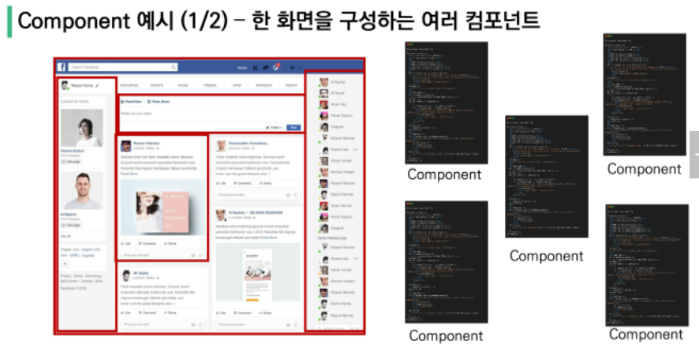
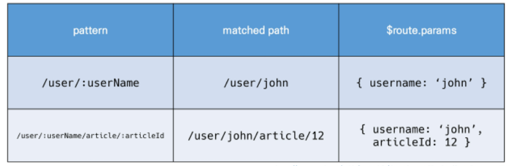

# 02

## SFC(Single File Component)

- vue의 컴포넌트 기반 개발의 핵심 특징
- 하나의 컴포넌트는 `.vue` 확장자를 가진 하나의 파일 안에서 작성되는 코드의 결과물
- 화면의 특정 영역에 대한 html, css, js 코드를 하나의 파일에서 관리

### component

- 기본 HTML 엘리먼트를 확장해 재사용 가능한 코드를 캡슐화하는데 도움을 줌

따라서, **`Vue 컴포넌트 === Vue 인스턴스 === `.vue` 파일`**



- 각 기능 별로 파일을 나누어 개발
- 반드시 파일 단위로 구분되어야 하는 것은 아님!!
- 단일 html 파일 안에서도 여러 개의 컴포넌트를 만들어 개발 가능


## Vue CLI

- vue.js 개발을 위한 표준 도구

### Node.js

- js를 브라우저가 아닌 환경에서도 구동할 수 있도록 하는 js 런타임 환경
- Chrome V8 엔진을 제공하여 여러 OS 환경에서 실행할 수 있는 환경을 제공

```bash
$ npm install -g @vue/cli  # 설치(-g가 없으면 특정 프로젝트에 귀속해 설치(global), 하지만 공식 문서에 -g쓰라고 하는 것만 쓰세요!! 맘대로 하지말고~)
$ vue --version  # 버전확인
$ vue create my-first-app  # pjt 생성
```

### Babel & Webpack

- Babel
  - js 컴파일러
  - js의 ECMAScript 2015+ 코드를 이전 버전으로 번역 및 변환시켜주는 도구
  - 최신 버전의 코드를 과거 버전 코드로 옮기는 번역기
- Webpack
  - 스태틱 모듈 번들러
  - 모듈 간의 의존성 문제를 해결하기 위한 도구
  - 모듈 수가 많아지고 라이브러리 혹은 모듈 간 의존성이 깊어지면서, 어떤 문제가 발생했을 때, 어떤 모듈 간 문제인지 파악이 어려워서 등장

아무튼 Vue CLI는 이러한 Babal, Webpack에 대한 초기 설정이 **자동**으로 되어있음

### Vue 프로젝트 구조

- node_modules
  - node.js 환경의 여러 의존성 모듈 (=venv)
- public/index.html
  - Vue 앱의 뼈대가 되는 파일
  - 실제 제공되는 단일 html 파일
- src
  - assets
    - webpack에 의해 빌드된 정적 파일
  - components
    - 하위 컴포넌트들이 위치
  - App.vue
    - 최상위 컴포넌트
  - main.js
    - webpack이 빌드를 시작할 때 가장 먼저 불러오는 entry point
    - 실제 단일 파일에서 DOM과 data를 연결했던 것과 동일한 작업이 이루어지는 곳
    - Vue 전역에서 활용할 모듈을 등록할 수 있는 파일
- babel.config.js
  - babel 관련 설정이 작성된 파일
- package.json
  - 프로젝트의 종속성 목록과 지원되는 브라우저에 대한 구성 옵션이 포함
- package-lock.json
  - node_modules에 설치되는 모듈과 관련된 모든 의존성을 설정 및 관리
  - 사용할 패키지의 버전을 고정


## Pass props & Emit event

- Vue app은 중첩된 컴포넌트 트리로 구성(부모-자식)
- 부모는 자식에게 데이터를 전달(Pass props)하며, 자식은 부모에게 일어난 일을 알림(Emit event)
- **props는 아래로, events는 위로**

### component 구조

- 템플릿, HTMl
- 스크립트, JS
- 스타일, CSS

### Props

- props는 부모 컴포넌트의 정보를 전달하기 위한 사용자 지정 특성
- 자식 컴포넌트는 props 옵션을 사용해 수신하는 props를 명시적으로 선언해야 함
- 컴포넌트의 data는 반드시 함수여야 함
  - 각 인스턴스가 모두 같은 data객체를 공유하므로, 새로운 data 객체를 반환해야 함
- v-bind를 사용해 js표현식으로 평가받을 수 있도록 함
- 부모 -> 자식 방향만 정보 전달 가능

### Emit event

- $emit(eventName)
  - 현재 인스턴스에서 이벤트를 트리거
  - 추가 인자는 리스너의 콜백 함수로 전달

```vue
<!-- 부모 컴포넌트 -->
<template>
  <div id="app">
    
    <!-- 3. 보여주기, print -->
    <!-- 카멜 케이스 -->
    <TheAbout :my-message='parentData'/>
    <!-- 케밥 케이스 -->
    <the-about :my-message='parentData' @child-input-change='ParentGetChange'></the-about>
  </div>
</template>

<script>
// 1. 불러오기, import
import TheAbout from './components/TheAbout.vue' // import에 변수명 지정 from에 경로

export default {
  name: 'App',
  // 2. 등록하기, resister
  components: {
    TheAbout,
  },
  data: function () {
    return {
      parentData: 'This!! is!! parent!!'
    }
  },
  methods: {
    ParentGetChange(inputData) {
      console.log('boss', '들린다!! 들린다고!!', inputData)
    }
  }
}
</script>
```

```vue
<!-- 자식 컴포넌트 -->
<template>
  <!-- 템플릿 안에는 반드시 하나의 element만 있어야 한다. -->
  <div>
    <h1>{{ myMessage }}</h1>
    <p>div 하나에 묶자!!</p>
    <input type="text" v-model='childInputData' @keyup.enter='childInputChange'>
  </div>
</template>

<script>
export default {
  name: 'TheAbout',
  props: {
    myMessage: String,
  },
  data: function() {
    return {
      childInputData: '들리냐고'
    }
  },
  methods: {
    childInputChange() {
      console.log('child', this.childInputData)
      // 부모 컴포넌트에게 {$emit('이름')} '이름'라는 이름의 이벤트를 발생
      this.$emit('child-input-change', this.childInputData)
    }
  }
}
</script>
```


## Vue Router

- 라우트(route)에 컴포넌트를 매핑하고, 어떤 주소에서 렌더링할 지 알려줌
- SPA 상에서 라우팅을 쉽게 개발할 수 있는 기능을 제공

```bash
$vue add router  # 어쩌구 y/n 나오면 그냥 무지성 y 때려도 무방
```

- 기존 프로젝트를 진행하는 도중에 추가하면 `App.vue` 파일을 덮어쓰므로, 프로젝트 내에서 위 명령을 실행하기 전에 백업해야함

### router-link

- 사용자 네비게이션을 가능하게 하는 컴포넌트
- 목표 경로는 `to` prop으로 지정
- 히스토리 모드에서 router-link는 클릭 이벤트를 차단해, 브라우저가 새로고침하지 않도록 함
- a 태그같은데 GET요청만 보내고 이벤트를 제거한 형태라고 생각

### router-view

- 주어진 라우트에 대해 일치하는 컴포넌트를 렌더링하는 컴포넌트
- 실제 컴포넌트가 DOM에 부착되어 보이는 자리를 의미

### History mode

- HTML History API를 사용해 router를 구현한 것
- 히스토리는 남기지만 실제 페이지는 이동하지 않는 기능을 지원 => 새로고침x

#### Named Routes

- 이름을 가지는 라우트
- 명명된 경로로 이동하려면 객체를 vue-router 컴포넌트 요소의 prop에 전달

#### 프로그래밍 방식 네비게이션

- router-link가 아닌, router의 인스턴스 메소드를 사용해 프로그래밍 방식으로 같은 작업 수행 가능
- vue 인스턴스 내부에서 라우터 인스턴스에 `$router`로 접근이 가능
  - `this.$router.push`로 다른 URL 호출 가능
  - `<router-link :to="..."> === $router.push(...)`

#### dynamic route matching

- 동적 인자 전달
- 주어진 패턴을 가진 라우트를 동일한 컴포넌트에 매핑해야 하는 경우
- 컴포넌트에서 `this.$route.params`로 사용 가능
- 

### component & views

- App.vue
  - 최상위 컴포넌트
- views/
  - router(index.js)에 매핑되는 컴포넌트를 모아두는 폴더
- components/
  - router에 매핑된 컴포넌트 내부에 작성하는 컴포넌트를 모아두는 폴더

```js
<!-- index.js -->
import Vue from 'vue'
import VueRouter from 'vue-router'
import HomeView from '../views/HomeView.vue'
import AboutView from '../views/AboutView'
import UserProfile from '../views/UserProfile'

Vue.use(VueRouter)

const routes = [
  {
    path: '/',
    name: 'home',
    component: HomeView
  },
  {
    path: '/about',
    name: 'about',
    component: AboutView
  },
  {
    path: '/user/:userId/:userName',
    name: 'profile',
    component: UserProfile
  }
]

const router = new VueRouter({
  mode: 'history',
  base: process.env.BASE_URL,
  routes
})

export default router

```

```vue
<!-- App.vue -->
<template>
  <div id="app">
    <nav>
      <router-link :to="{ name: 'home' }">Home</router-link> |
      <router-link :to="{ name: 'about' }">About</router-link>
    </nav>
    <router-view/>
  </div>
</template>
```

```vue
<!-- AboutView.vue -->
<template>
  <div class="about">
    <h1>This is an about page</h1>
    <button @click="moveToHome">home</button>
  </div>
</template>

<script>

export default {
  name: 'AboutView',
  methods: {
    moveToHome() {
      this.$router.push({ name: 'home' })
    }
  }
}
</script>
```

```vue
<!-- UserProfile -->
<template>
  <div>
    <h1>User Profile</h1>
    <p>당신의 ID는 {{ user.userId }}</p>
    <p>당신의 이름은 {{ user.userName }}</p>
  </div>
</template>

<script>
export default {
  name: 'UserProfile',
  data: function () {
    return {
      user: this.$route.params,
    }
  }
}
</script>
```


### Vue Router가 필요한 이유?

- SPA 등장 이후, 서버는 index.html 하나만 제공
- 이후 모든 처리는 HTML 위에서 JS 코드를 활용해 진행하고, 요청에 대한 처리를 더이상 서버가 하지 않음
- Vue Router는 라우팅의 결정권을 가진 Vue.js에서 라우팅을 편리하게 할 수 있는 tool을 제공해주는 라이브러리


