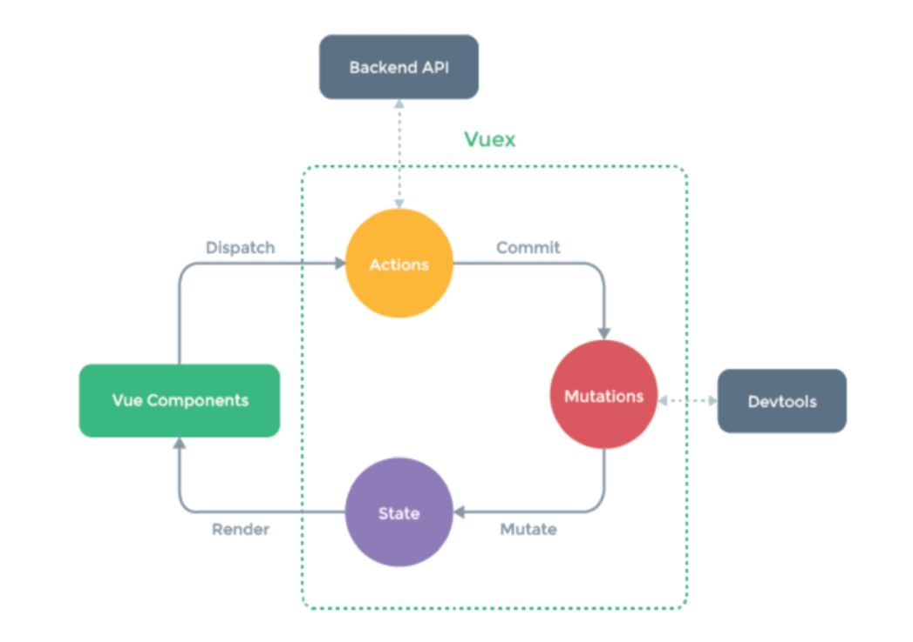

# 03

## Vuex

- Statement Management pattern + Library for vue.js === 상태 관리 패턴 + 라이브러리
- 앱의 모든 컴포넌트에 대한 **중앙 집중식 저장소 역할**

### state

- state는 곧 data며, 해당 앱의 핵심이 되는 요소

### 상태 관리 패턴

- 컴포넌트의 공유된 상태를 추출하고 이를 전역에서 관리하도록 함
- 컴포넌트는 커다란 view가 되며, 모든 컴포넌트는 트리에 상관없이 상태에 액세스 하거나 동작을 트리거 할 수 있음

### 기존 props & emit event

- 데이터는 단방향 흐름으로, 부모<->자식 간의 전달만 가능 => 흐름을 직관적으로 파악할 수 있지만, 컴포넌트 중첩이 많이질 경우, 불편해짐

### Vuex management pattern

- 중앙 저장소(store)에 state를 모아두고 관리
- 규모가 큰(컴포넌트 중첩이 깊은) 프로젝트에서 매우 효율적


## Vuex Core Concepts



### State

- 중앙에서 관리하는 모든 상태 정보(data)
  - vuex는 single state tree를 사용
  - 즉, 이 단일 객체는 모든 앱 상태를 포함하는 원본 소스의 역할을 함
  - state의 변화가 일어나면, 해당 state를 공유하는 여러 컴포넌트의 DOM은 알아서 렌더링

### Mutations

- 실제로 state를 변경하는 유일한 방법
- mutation의 handler(핸들러 함수)는 반드시 동기적이어야 함
- 첫 인자로 항상 `state`를 받음
- Actions에서 `commit()` 메소드에 의해 호출됨

### Actions

- Mutations와 비슷하나, 다름!
  - state를 변경하는 대신, mutations를 `commit()` 메소드로 호출해 실행
  - mutations와 달리 비동기 작업이 포할될 수 있음
- `context` 인자를 받음
  - state를 직접 변경할 수 있으나, **하지않음** => 명확한 역할 분담
- 컴포넌트에서 `dispatch()` 메소드에 의해 호출됨

### Getters

- state를 변경하지 않고 활용하여 계산을 수행(computed와 유사)
- computed속성과 마찬가지로, getters의 결과는 state 종속성에 따라 캐시(cached)되고, 종속성이 변경된 경우에만 다시 재계산됨
- state를 변경하지 않음 => 계산만 함


## Todo app with Vuex

- 실습, *todo-vuex-todo 폴더 참고*

```bash
$ vue create todo-vuex-app
$ cd todo-vuex-app
$ vue add vuex  # 아무튼 y (commit 여부)
```

```vue
<!-- App.vue -->
<template>
  <div id="app">
    <h1>My TODOs</h1>
    <todo-list></todo-list>
    <todo-form></todo-form>
  </div>
</template>

<script>
import TodoList from '@/components/TodoList.vue'
import TodoForm from '@/components/TodoForm.vue'

export default {
  name: 'App',
  components: {
    TodoList,
    TodoForm
  },
}

</script>
```


### Read Todo

```vue
<!-- TodoList.vue -->
<template>
  <div>
    <todo-list-item v-for="todo in todos" :key="todo.date" :todo="todo"></todo-list-item>
  </div>
</template>

<script>
import TodoListItem from '@/components/TodoListItem.vue'
import { mapState } from 'vuex'

export default {
  name: 'TodoList',
  components: {
    TodoListItem,
  },
  computed: {
    ...mapState(['todos',])
  },
}
</script>
```

```js
// store/index.js
export default new Vuex.Store({
  state: {  // data
    todos: [
    ]
  },
```


### Create Todo

```vue
<!-- TodoForm.vue -->
<template>
  <div>
    Todo Form
    <input type="text" @keyup.enter="createTodo" v-model.trim="todoTitle">
  </div>
</template>

<script>
export default {
  name: 'TodoForm',
  data() {
    return {
      todoTitle: ''
    }
  },
  methods: {
    createTodo() {
      const newTodo = {
        title: this.todoTitle,
        isCompleted: false,
        date: new Date().getTime(),
      }
      this.$store.dispatch('createTodo', newTodo)
      this.todoTitle = ''
    }
  },
}
</script>
```

```js
// store/index.js
export default new Vuex.Store({
  mutations: {  // change!
    CREATE_TODO(state, newTodo) {
      state.todos.push(newTodo)
    },
  },
  actions: {  // methods
    createTodo({ commit }, newTodo) { // const { commit } = context
      commit('CREATE_TODO', newTodo)
    },
  },
})

```

### Delete Todo, Update Todo

```vue
<!-- TodoListItem.vue -->
<template>
  <div>
    <span @click="updateTodoStatus(todo)" :class="{ 'is-completed': todo.isCompleted }">
    {{ todo.title }}
    </span>
    <button @click="deleteTodo(todo)">[x]</button> <!-- ()는 실행이 아니라 넘겨주는 인자를 뜻함 -->
  </div>
</template>

<script>
import { mapActions } from 'vuex'

export default {
  name: 'TodoListItem',
  props: {
    todo: Object,
  },
  methods: {
    ...mapActions(['deleteTodo', 'updateTodoStatus'])
    }
}
</script>

<style scoped>
  .is-completed {
    text-decoration: line-through;
  }
  div {
    border: 2px solid black;
    margin: 2px;
    padding: 2px;
  }
  span {
    cursor: pointer;
  }
</style> 

```

```js
// store/inedx.js
export default new Vuex.Store({
  mutations: {  // change!
    DELETE_TODO(state, todoItem) {
      const idx = state.todos.indexOf(todoItem)
      state.todos.splice(idx, 1)
    },
    UPDATE_TODO_STATUS(state, todoItem) {
      state.todos = state.todos.map(todo => {
        if (todo === todoItem) {
          todo.isCompleted = !todo.isCompleted
        }
        return todo
      })
    },
  },
  actions: {  // methods
    deleteTodo({ commit }, todoItem) {
      if (confirm('진짜임?')) {
        commit('DELETE_TODO', todoItem)
      }
    },
    updateTodoStatus({ commit }, todoItem) {
      commit('UPDATE_TODO_STATUS', todoItem)
    }
  },
})
```

### Getters

```vue
<!-- App.vue -->
<template>
  <div id="app">
    <h1>My TODOs</h1>
    <h2>전체: {{ allTodosCount }}</h2>
    <h2>완료: {{ completedTodoCount }}</h2>
    <h2>하는중: {{ unCompletedTodoCount }}</h2>
    <todo-form></todo-form>
    <todo-list></todo-list>
  </div>
</template>

<script>
import TodoList from '@/components/TodoList.vue'
import TodoForm from '@/components/TodoForm.vue'
import { mapGetters } from 'vuex'

export default {
  name: 'App',
  components: {
    TodoList,
    TodoForm
  },
  computed: {
    ...mapGetters(['completedTodoCount', 'unCompletedTodoCount', 'allTodosCount'])
  },
}
</script>
```

```js
// store/index.js
export default new Vuex.Store({
  getters: {  // computed
    // 현재 끝난 일의 개수
    allTodosCount(state) {
      return state.todos.length
    },
    completedTodoCount(state) {
      return state.todos.filter(todo => todo.isCompleted).length
    },
    unCompletedTodoCount(state) {
      return state.todos.filter(todo => !todo.isCompleted).length
    }
  },
```


## LocalStorage

- 사용자의 컴퓨터에 저장하는 로컬 db 같은? 그런? 
- 새로고침해도 남아있음
- 브라우저를 종료하거나, 애플리케이션 탭에서 지우거나 하면 사라짐

### vuex-persistedstate

- Vuex state를 자동으로 브라우저의 LocalStorage에 저장해주는 라이브러리

  ```bash
  $ npm i vuex-persistedstate
  ```

```js
// LocalStorage raw code (persistedstate 안쓴거)
import Vue from 'vue'
import Vuex from 'vuex'

Vue.use(Vuex)

export default new Vuex.Store({
  state: {  // data
    todos: []
  },
  getters: {  // computed
    // 현재 끝난 일의 개수
    allTodosCount(state) {
      return state.todos.length
    },
    completedTodoCount(state) {
      return state.todos.filter(todo => todo.isCompleted).length
    },
    unCompletedTodoCount(state) {
      return state.todos.filter(todo => !todo.isCompleted).length
    }
  },
  mutations: {  // change!
    LOAD_TODOS(state) {
      const todosString = localStorage.getItem('todos')
      state.todos = JSON.parse(todosString)
    },
    CREATE_TODO(state, newTodo) {
      state.todos.push(newTodo)
    },
    DELETE_TODO(state, todoItem) {
      const idx = state.todos.indexOf(todoItem)
      state.todos.splice(idx, 1)
    },
    UPDATE_TODO_STATUS(state, todoItem) {
      state.todos = state.todos.map(todo => {
        if (todo === todoItem) {
          todo.isCompleted = !todo.isCompleted
        }
        return todo
      })
    },
  },
  actions: {  // methods
    saveTodos({ state }) {
      const jsonData = JSON.stringify(state.todos)
      localStorage.setItem('todos', jsonData)
    },
    createTodo(context, newTodo) { // const { commit } = context
      context.commit('CREATE_TODO', newTodo)
      context.dispatch('saveTodos')      
    },
    deleteTodo({ commit, dispatch }, todoItem) {
      if (confirm('진짜임?')) {
        commit('DELETE_TODO', todoItem)
        dispatch('saveTodos')
      }
    },
    updateTodoStatus({ commit, dispatch }, todoItem) {
      commit('UPDATE_TODO_STATUS', todoItem)
      dispatch('saveTodos')
    }
  },
})
```

```vue
<script>
import TodoList from '@/components/TodoList.vue'
import TodoForm from '@/components/TodoForm.vue'
import { mapGetters, mapMutations } from 'vuex'

export default {
  name: 'App',
  components: {
    TodoList,
    TodoForm
  },
  computed: {
    ...mapGetters(['completedTodoCount', 'unCompletedTodoCount', 'allTodosCount'])
  },
  methods: {
    ...mapMutations(['LOAD_TODOS'])
  },
  created() {
    this.LOAD_TODOS()
  }
}
</script>
```


```js
// persistedstate 쓰면, 위에거 다 필요없이 plugins만 추가하면 알아서 해줌
import createPersistedState from "vuex-persistedstate"

export default new Vuex.Store({
  plugins: [  // localStorage에 state 자동저장
    createPersistedState()
  ],
```

